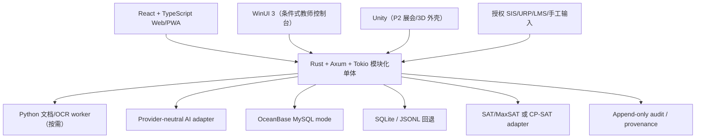

# jiaowu2K26 · 工程与技术选型

> **状态：待用户审核的赛前技术提案。**本文件没有授权安装依赖、创建工程、启动数据库、调用模型或构建产品。
> **现场原则：**正式开赛后以前 6 小时小样决定采用或回退；团队熟悉度高于“技术看起来新”。
> **更新时间：**2026-07-21。

## 审核结论先行

| 层 | 建议 | 当前决策 | 审核要点 |
|---|---|---|---|
| 主客户端 | React + TypeScript + Vite 的 Web/PWA | **建议批准为 Primary** | 最适合高密度数据、跨设备、72h 和快速演示 |
| UI 系统 | CSS Design Tokens + 可访问 Headless 组件 + Framer Motion | **建议批准** | 运动只服务状态与转场；不复制 2K 视觉 |
| 受控视觉 | PixiJS / Three.js 仅用于局部场景 | **按需 Secondary** | 只有当 Canvas/3D 明显提升核心理解才引入 |
| Windows 原生 | WinUI 3 | **Secondary** | 仅教师审核台/控制台，2h 空白工程闸门通过才用 |
| 游戏引擎 | 已装 Unity 6000.3.17f1 | **P2/展会外壳候选** | 可做 Campus Hub，不进入 P0 |
| 虚幻引擎 | Unreal Engine 5.8 | **P0 拒绝，暂不安装** | 机器能跑，但学习、资产、构建与包体成本不匹配 |
| 核心 API | Rust + Axum + Tokio 模块化单体 | **条件主选** | 有 Rust 负责人且 6h 纵向切片通过 |
| 后端回退 | FastAPI 或 Node/Fastify | **必须保留** | 选团队真正熟悉的一种，不同时维护三套 |
| 主数据 | OceanBase MySQL 模式 + SQLx | **条件主选** | migration、事务、关键查询和兼容性实测通过 |
| 数据回退 | SQLite；必要时 JSONL 只读/演示 | **必须保留** | 与主库共享 repository 合同 |
| 文档提取 | Python 独立 worker / CLI | **按需批准** | OCR/PDF 生态成熟；Rust 负责领域状态而非强行包办 |
| AI | Provider-neutral adapter + 当场确认的 1 个赞助模型 | **待权益确认** | 结构化输出、source IDs、数据条款、配额、延迟 |
| 个人规划求解 | SAT / MaxSAT | **P1 候选** | 依赖/互斥/分层偏好小样对比后定库 |
| 机构排课 | OR-Tools CP-SAT | **P2 候选** | 时间、容量、教室、教师资源问题单独建模 |
| 搜索/RAG | 先关键词/来源链接，再按证据加向量层 | **建议批准** | 不为“RAG”标签增加不可验证复杂度 |
| 部署 | Local-first；Zeabur/确认赞助云作为 Secondary | **开赛后决定** | 演示不能依赖唯一公网路径 |

**推荐组合：Web/PWA + Rust 模块化单体 + OceanBase 条件主库 + SQLite 回退 + 一个可替换模型。**这套组合有一点“打破常规”的工程辨识度，但仍把真正的新意留给可信审核链和 Conda 式学期解释，而不是堆技术名词。

## 为什么底座可以 Rust-first，但不能 Rust-only

Rust 适合表达：

- `draft → approved → published / removed` 审核状态机；
- 不可破坏的数据不变量和类型化错误；
- 数据库、模型、OCR、SIS 和求解器的可替换适配器；
- 可重放事件、事务和高可靠本地服务。

Rust 不应被强迫承担：

- 团队不熟悉时的全部 Web 交付；
- Python 生态明显更成熟的 OCR/PDF/求解实验；
- 为了“全 Rust”重写成熟解析库；
- 72 小时里的微服务、消息总线和复杂部署。

**6 小时闸门：**至少一位队员能独立调试，在最终机器上完成一条写入、一条查询、一次审核状态迁移、一次前端调用和一个失败响应。任一关键项未通过，立即切换团队最熟悉的单 API 后端。

## 目标架构



**形态：模块化单体。**模块之间用 Rust trait / 内部接口和稳定领域对象隔离，而不是拆成网络服务。只有文档提取、外部模型和硬件这类天然异构能力通过进程/API 边界连接。

## 内部模块

| 模块 | 职责 | 禁止渗透 |
|---|---|---|
| `identity` | 演示身份、角色与最小权限 | UI 路由不能代替后端鉴权 |
| `content` | Material、SourceFragment、GeneratedObject、版本 | 不保存供应商专属响应为领域真相 |
| `review` | 修改、通过、移除、发布状态机 | 未通过对象不得被 UI 绕过发布 |
| `academic_mirror` | 外部数据、权威等级、时效、冲突 | 不冒充 SIS，不默认写回 |
| `resolver` | CourseSpec、pins、约束、方案、解释、lock | 不把个人规划与全校排课混成一个模型 |
| `career` | 赛季、课程阵容、目标、里程碑和事件引用 | 不复制其他模块的业务数据 |
| `opportunity` | 机会、资格、同意、权益和进度镜像 | 不自动投递、不付费排序 |
| `providers` | 模型、OCR、存储、SIS、求解器适配器 | 供应商 SDK 不进入核心实体 |
| `audit` | 运行、审核、发布、开源与数据使用证据 | 审计数据也受最小权限与保留期限 |

## 最小领域合同

### 内容与审核

```json
{
  "source_fragment": {
    "id": "src-001",
    "material_id": "lec-01",
    "type": "slide | transcript | handout",
    "locator": "P.12 | 03:45-04:12 | text-span",
    "text": "...",
    "source_version": 1,
    "rights_status": "authorized_demo"
  },
  "generated_object": {
    "id": "obj-001",
    "type": "quiz | review_card | script",
    "source_ids": ["src-001"],
    "generation_mode": "model | rule | fixture",
    "review_status": "draft | approved | removed",
    "published_version": null
  },
  "review_event": {
    "object_id": "obj-001",
    "action": "edit | approve | remove | publish | withdraw",
    "actor_id": "teacher-01",
    "timestamp": "ISO-8601",
    "reason": "...",
    "changes": {}
  }
}
```

### Academic Mirror

```text
source_system / external_id / source_version
fetched_at / effective_at / authority_level
raw_reference / normalized_payload
consent_basis / correction_route / expires_at
```

### Semester Resolver

```text
CourseSpec + SemesterPrefix + Pins + CatalogVersion
                         ↓
              dependency/conflict graph
                         ↓
          hard constraints + ordered preferences
                         ↓
 candidate plans + unsat explanation + unknowns
                         ↓
       diff + transaction preview + semester.lock
```

### Provider 响应信封

```json
{
  "provider": "event-confirmed-provider",
  "model_or_rule_version": "exact-id",
  "input_hashes": ["sha256:..."],
  "source_ids": ["src-001"],
  "structured_output": {},
  "schema_valid": true,
  "started_at": "ISO-8601",
  "latency_ms": 0,
  "fallback_used": false,
  "error": null
}
```

## 数据不变量

1. 无可定位来源的 AI 对象不能进入教师审核；
2. 只有 `approved` 的具体版本可发布；
3. 审核、发布、撤回和数据使用事件只追加；
4. 外部记录始终带来源、版本、获取时间和权威等级；
5. What-if 与正式结果在数据类型和界面文案上同时区分；
6. 求解结果必须包含依据、未知、未满足和相对当前方案的 diff；
7. 模型/数据库/供应商 ID 不进入核心领域枚举，保持可替换；
8. 演示 fixture、缓存结果和实时结果不可共用同一状态标签。

## OceanBase 评估

### 为什么匹配

- 来源、对象、审核事件、发布版本是关系清晰且需要事务的数据；
- Academic Mirror 和课程关系需要版本化、查询和审计；
- MySQL 模式降低 Rust SQLx 的接入门槛；
- 若进入赞助/赛道或需要展示可靠数据路径，具有叙事价值。

### 为什么只是条件主选

- MySQL 兼容不等于每个行为与原生 MySQL 完全相同；
- 云账号、网络、版本、配额和数据条款尚未确认；
- P0 的数据量不需要分布式能力；
- 连接或迁移问题不能拖垮 72 小时。

### 采用测试

1. 连接与 TLS；
2. SQLx migration；
3. 审核状态事务提交和回滚；
4. 来源—对象—事件的关键 join；
5. 唯一约束、索引和时间字段行为；
6. 切换 SQLite 后领域测试仍通过。

未通过任一关键项就切 SQLite，并在路演中诚实说明 OceanBase 是已评估而未采用的候选。

## Conda 式求解器实现路线

### 借鉴的不是 Conda 环境，而是求解协议

- `MatchSpec` → `CourseSpec`；
- package index → 学期课程目录；
- prefix / installed → 已修 + 当前课表；
- pins → 不可移动必修/时间块；
- dependencies / conflicts → 先修并修 / 时间与资源冲突；
- final state → 候选学期阵容；
- transaction → add/drop/swap；
- lockfile → 可重现 `semester.lock`；
- unsatisfiable explanation → 为什么无解、放宽什么。

### 后端选择

| 问题 | 候选 | 采用依据 |
|---|---|---|
| 个人课程组合、毕业路径 | SAT / MaxSAT | 布尔依赖、互斥、分层偏好和最小变更自然 |
| 教室/教师/时间/容量排程 | OR-Tools CP-SAT | 区间、资源互斥与多目标更自然 |
| 现场无法集成 | 确定性启发式 | 能给 best-feasible、完整违例和稳定复现 |

当前**不直接复用 Conda 或 libsolv 代码**。先固定 `SolverBackend` 输入/输出与解释，再用最小数据集比较求解质量、集成时间、可解释性和许可证。

## AI 与文档处理

### AI 主路径

- 现场只选一个已确认赞助/可用模型；
- 要求结构化输出、可回指 `source_ids`、错误可区分；
- 核心状态由本地服务决定，模型不能直接发布或修改权威记录；
- 网络/额度/格式失败时切规则或 fixture，明确显示 `fallback_used`；
- 不把密钥、课程材料或个人数据提交到代码仓库。

### Python worker 的正确位置

Python 只承担成熟生态明显有优势的 PDF、PPT、OCR、ASR 或求解实验。输入输出使用版本化 JSON/文件合同，失败不改变领域状态；成功产物先进入草稿/校对，不直接发布。

### RAG 采用顺序

1. 页码/时间戳切片 + 关键词/全文检索；
2. 来源覆盖和检索失败有真实数据后，再评估 embedding；
3. 向量索引必须保存模型、版本、切片和重建方式；
4. 向量相似度不等于证据支持度。

## 客户端与设计技术

### Web/PWA Primary

- React + TypeScript + Vite；
- Design Tokens 管理色彩、字号、间距、圆角、动效和密度；
- Radix UI 等可访问 Headless 组件，按实际选定版本复核许可证；
- Framer Motion 只处理状态转场、赛季叙事和“减少动效”兼容；
- 图表优先语义化 HTML/SVG/Canvas 库，并提供文本等价；
- PWA 缓存只保存允许离线的数据，不缓存敏感材料到不可控位置。

### WinUI 3 Secondary

适合 Windows 主机端教师审核/演示控制台：来源对照、审核、硬件状态、日志和回退。只有最终演示以 Windows 为主、队内有 C#/XAML 负责人、开赛后 2 小时空白工程稳定启动、数据合同与业务层解耦时采用。否则只用 Web。

独立参考库：`D:\10451\Users\10451\Downloads\WinUI3-Reference\GUIDE.md`。它是研究库，不是可整包复制的项目模板。

## Unity 与 Unreal Engine 决策

### 本机证据

| 项目 | 状态 |
|---|---|
| Windows | Windows 11 Home，build 26200 |
| CPU / 内存 | Intel i7-13700H；约 64GB RAM |
| GPU | NVIDIA RTX 4070 Laptop GPU，8188 MiB VRAM；Intel Iris Xe |
| 存储 | C 卷约 3.7TB，总空闲约 1.09TB（核对时） |
| Unity | Unity 6000.3.17f1 + Unity Hub 3.13.0 已安装 |
| Visual Studio | Visual Studio Community 2026 18.7.1；Native Game workload 可见 |
| Unreal | 未安装 Unreal Engine；未发现 Epic Games Launcher 主程序 |
| Steam | 常见路径未发现 Steam 安装 |

这是只读盘点，没有更改系统。GPU 显存以 `nvidia-smi` 的 8188 MiB 为准，不采用 WMI 的错误数值。

### 最新版本纠正

截至 2026-07-21，官方最新主版本是 **Unreal Engine 5.8**，不是 UE6。Epic 于 2026-06-17 发布 UE 5.8，并称其为计划中的最后一个 UE5 大版本，同时推进 UE6 工作；“UE6 正式最新版”目前不成立。

- [UE 5.8 发布公告](https://www.unrealengine.com/news/unreal-engine-5-8-is-now-available)
- [UE 5.8 Release Notes](https://dev.epicgames.com/documentation/unreal-engine/unreal-engine-5-8-release-notes?lang=en-US)
- [硬件与软件规格](https://dev.epicgames.com/documentation/en-us/unreal-engine/hardware-and-software-specifications-for-unreal-engine)
- [安装指南](https://dev.epicgames.com/documentation/unreal-engine/install-unreal-engine?lang=en-US)

### 选择矩阵

| 维度 | Web/PWA | Unity（已装） | Unreal 5.8 |
|---|---:|---:|---:|
| 智课工坊高密度审核 UI | 5/5 | 2/5 | 2/5 |
| 72h 开发与调试 | 5/5 | 3/5（视队员） | 1–2/5 |
| 跨设备分享 | 5/5 | 2/5 | 1/5 |
| 高保真 3D / 电影感 | 2/5 | 4/5 | 5/5 |
| 当前环境准备度 | 4/5 | 5/5 | 1/5 |
| 包体/构建/资产风险 | 5/5 | 3/5 | 1/5 |
| 直接支持 P0 价值 | 5/5 | 2/5 | 1/5 |

### 推荐

**P0 不用游戏引擎。**如果 P0 稳定、团队已有 Unity 经验且赛道需要更强展会表现，可用现成 Unity 做一个可丢弃的 P2 Campus Hub/赛季入口，业务仍走同一 API。Unreal 5.8 只在“核心差异已变成高保真 3D 校园/角色/虚拟制作、有人专职 Blueprint/C++、并有至少 12–18 小时独立预算”时再考虑。

因此当前不安装 Epic Games Launcher 或 UE 5.8。安装本身可能占用大量下载、磁盘、Shader/Derived Data 缓存和配置时间，而且会在开赛前引入不必要环境变化。若用户之后明确批准并满足闸门，再执行官方 Launcher 安装、固定版本和一次空白工程验证。

## 是否需要购买 NBA 2K / DRM 影响

目前**无需购买**。官方 Courtside Reports 已覆盖 Builder、MyCAREER、City、MyTEAM、MyNBA/MyGM、The W、Gameplay、Presentation 和 Seasons，且本地已建立 30 张官方界面研究库，足够完成机制和信息架构分析。

若以后为了手感、导航节奏、声音反馈或完整用户旅程购买当前 PC 版，正常游玩、人工记录和截图不受“研究目的”本身影响；但文件级逆向会受到技术和法律边界限制。Steam 的 NBA 2K26 页面当前列明 Denuvo Anti-Tamper、24 小时 5 台机器激活限制、2K Sports 账号和内核级 Easy Anti-Cheat：

- [NBA 2K26 Steam 页面](https://store.steampowered.com/app/3472040/NBA_2K26/)

允许的研究：正常游玩、菜单地图、任务流计时、可访问性观察、截图/笔记（仍遵守平台条款与版权）。不做：绕过 DRM/反作弊、内存抓取、二进制反编译、资源提取、自动化作弊或修改在线服务。DRM 会妨碍文件级分析和离线可移植性，但不妨碍人工 UX 观察。

## 官方 2K 研究库

- 本地指南：`D:\10451\Users\10451\Downloads\NBA2K-Design-Reference\GUIDE.md`；
- 逐图清单：`D:\10451\Users\10451\Downloads\NBA2K-Design-Reference\SOURCE-MANIFEST.json`；
- 30 张图片：`D:\10451\Users\10451\Downloads\NBA2K-Design-Reference\images\`；
- 使用边界：只做内部研究，不进入参赛产品，不一比一复刻。

## 开源复用

### 直接依赖候选

| 候选 | 用途 | 上游许可（采用时重验） | 状态 |
|---|---|---|---|
| React / Vite | Web 客户端与构建 | MIT | Primary 候选 |
| Rust / Axum / Tokio | 核心 API | Rust 多许可 / Axum、Tokio MIT | 条件主选 |
| SQLx | OceanBase/SQLite 数据访问 | MIT OR Apache-2.0 | 条件主选 |
| OceanBase | 事务与关系数据 | MulanPubL-2.0 | 条件运行时 |
| OR-Tools | 机构排程 | Apache-2.0 | P2 候选 |

### 参考/思想借鉴

- Conda、libsolv：求解语义与算法参考，不直接复用代码；
- WinUI Gallery、Windows Community Toolkit：控件/交互参考；
- openSIS、Frappe Education、Gibbon、OpenEduCat：领域对象和工作流参考，不作为 P0 底座；
- NBA 2K：通用产品机制研究，不复用素材、代码或品牌。

### 现场登记必填

`upstream / exact_version_or_commit / registry_or_download / sha256_if_applicable / SPDX / LICENSE+NOTICE / transitive_check / reuse_mode / local_changes / security_check / event_rule_check / fallback`

## 赞助资源接入顺序

| 位置 | 候选 | 使用条件 |
|---|---|---|
| Primary model | 阶跃星辰等开幕式确认的一个赞助模型 | 账号、Credit、结构化输出、数据条款与延迟通过 |
| Secondary review | 飞书 Base | 权限/Token/限流在 2h 内通过；本地数据合同仍独立 |
| Hardware 二选一 | D-Robotics RDK 或 TuyaOpen | 精确 SKU/配件/许可已确认，6h 内形成一个真实事件 |
| 轻量增强 | Nothing Glyph | 机型、系统、AAR 和权限匹配；不影响核心闭环 |
| P1 高风险最多一个 | XR、机器人、实时语音等 | P0 已稳定、队员有经验、赛道明确需要 |

已知但未确认的资源一律保持 `unknown`，不打伪精确分。地瓜机器人两份原 PDF 在新环境当前不可用；已保留原路径、字节数和 SHA-256，重新提供后再复核。

## 测试与可观测性

### 正式开赛后最低测试

- Rust/后端：领域不变量单元测试、状态机测试、repository 合同测试；
- 求解器：固定夹具、无解解释、确定性、方案 diff 和属性测试；
- API：schema/错误码/权限/回退契约；
- Web：核心路径 Playwright E2E、键盘、对比度、减少动效、断网；
- 数据：migration、事务回滚、备份/恢复、fixture 与真实数据隔离；
- Demo：冷启动、断网、模型超时、数据库不可用和演示机重启。

### 结构化运行记录

每次真实运行保存：输入与权利、版本/哈希、模型/规则、source IDs、schema 结果、审核事件、延迟/成本、失败/重试、回退与测试人。没有记录的数字不能进 Pitch。

## 前 6 小时技术闸门

| 时间 | 必须完成 | 失败动作 |
|---|---|---|
| 0–1h | 保存规则、确定团队角色、主题/赛道、演示机与授权样例 | 不建支线 |
| 1–2h | Web → API 最小请求；一个 source record；一个状态迁移 | 回退更熟悉后端/UI |
| 2–4h | Rust 与 OceanBase/SQLite spike；一个模型结构化输出 | 数据库或模型失败立即切回退 |
| 4–6h | 冻结 Primary、Secondary、Fallback；登记依赖与版本 | 未通过技术移出 P0 |

## 明确不进入 P0

- 微服务、Kubernetes、事件总线和多云编排；
- UE/Unity 3D 城市、双 XR、多人在线大厅；
- 多模型、多 Agent 展柜或临时训练大模型；
- 真实 SIS 写回、自动投递、支付、区块链资格；
- 全校排课、公开能力排名、付费机会系统；
- 同时维护 Web、WinUI、Unity 和 Unreal 四套客户端。

## 待用户审核的五个问题

1. 是否批准 Web/PWA 为 Primary，而将 WinUI、Unity 和 Unreal 全部降为条件式外壳？
2. 是否批准 Rust + Axum + Tokio 为条件主选，并同意 6 小时未通过就回退？
3. 是否批准 OceanBase 条件主选 + SQLite 强制回退，而不是无条件绑定？
4. 若 P0 稳定，P1 优先评估 Academic Mirror、Roster Lab、World Exam Finals 还是 Opportunity Market？
5. 是否确认当前不安装 Unreal、不购买 NBA 2K，等实际队伍与赛道出现后再决定？
