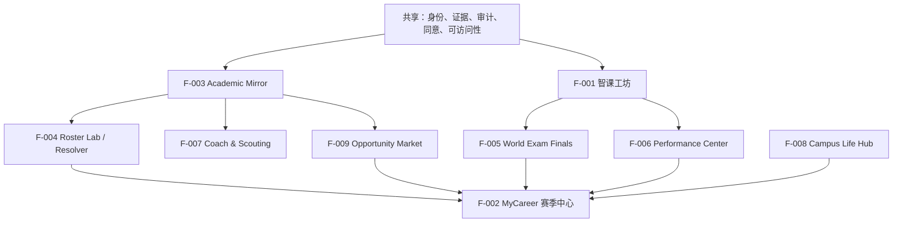

# jiaowu2K26 · 产品规格

> **唯一总项目：**`jiaowu2K26`。**智课工坊**是最初想法，现为首个 P0 模块。
> **状态：**AdventureX 赛前产品研究与现场计划；未实现、未创建本届原型或可运行工程。
> **基线日期：**2026-07-21。每个条目都是待验证规格，不是完成声明。

## 两句话介绍

**jiaowu2K26 不是给旧教务系统换皮，而是把大学四到八年的学习、选课、成长与协作重构成 MyCareer 式大学生涯：学期是赛季、课程是阵容、每一次选择都有依据，每一次进步都能回放。它从首个可验证模块“智课工坊”起步，让 AI 先亮出来源、由教师审核后再发布，逐步把冷冰冰的办事大厅升级成可信、可玩、真正让人想打开的大学生活体验层。**

## 问题、角色与边界

传统 SIS / URP 擅长保存学籍、选课、成绩和正式交易，LMS 擅长承载课程与作业，却很少帮助学生理解：我处于哪个阶段、这次选择会改变什么、AI 内容是否可信、下一步该做什么，以及四到八年的努力如何连成一段可回看的生涯。

jiaowu2K26 的角色不是替换权威系统，而是在其上提供解释、规划、学习、反馈与叙事：

```text
SIS / URP / LMS / 课程目录 / 学生支持系统   ← 权威记录与正式流程
                         ↓ 授权 API / 导出 / 手工样例
                 F-003 Academic Mirror       ← 来源、版本、时效、权威等级
                         ↓
                    jiaowu2K26                ← 解释、What-if、学习、反馈、叙事
```

主要角色：

- **学生 / 学习者：**看懂当前赛季、完成学习、规划路径、发现机会，并控制自己的资料；
- **教师 / 课程团队：**核对来源、审核内容、发布学习单元并查看可行动的班级反馈；
- **导师 / 辅导员：**基于授权信息提供建议，不替学生或学校做决定；
- **课程 / 项目 / 机会提供方：**维护公开信息、资格和纠错渠道；
- **管理员 / 研究者：**管理数据源、规则版本、容量与合规，但不获得无限制查看权。

不在黑客松 P0 内：学籍主库、财务、正式成绩写回、全校排课、生产级身份治理、真实招聘自动投递、支付、完整 3D 校园和长期运营后台。

## 共同产品原则

1. **体验层不冒充权威层：**镜像、预测和 What-if 必须显式标注。
2. **AI 必须 Show your work：**能回到来源、规则、版本和人的决定。
3. **人保留决定权：**教师决定发布，学生决定披露，学校决定正式资格。
4. **2K 是产品语法：**借鉴赛季、阵容、训练、关键事件、回放和管理循环，不复制品牌与画面。
5. **解释优先于综合分：**先显示已知、未知、依据和下一步，再考虑汇总指标。
6. **游戏化不制造伤害：**不付费买分、不随机分配教育机会、不公开羞辱、不把人商品化。
7. **小闭环先于功能展柜：**P0 只证明“来源 → 审核 → 发布 → 互动 → 回放”。
8. **每项能力可回退：**网络、模型、数据库或硬件失效时仍可诚实演示核心价值。

## 跨模块共享能力

这些能力只实现一次，各 F 模块按需调用：

| ID | 共享能力 | 最低要求 |
|---|---|---|
| X-01 | 身份与角色 | 学生、教师、导师、管理员最小权限分离；测试身份显式标记 |
| X-02 | 来源与证据 | 每条外部事实保存来源、定位、版本、时间、权威等级和可用权利 |
| X-03 | 事件与审计 | 重要动作追加记录；包含操作者、前后状态、原因和时间 |
| X-04 | 版本与纠错 | 支持修订、撤回、过期、申诉和对旧结果的影响说明 |
| X-05 | 同意与隐私 | 默认最小采集、最小披露；可查看、导出、撤回和删除 |
| X-06 | 搜索与筛选 | 结果可解释；筛选条件可清空；不默认使用敏感属性 |
| X-07 | 通知 | 显示来源和可操作下一步；可静音、汇总、设免打扰 |
| X-08 | 可访问性 | 键盘、读屏、对比度、字幕、减少动效、非颜色状态表达 |
| X-09 | 离线与降级 | 明确“实时 / 缓存 / 演示样例 / 不可用”，不伪装实时成功 |
| X-10 | 可解释推荐 | 给出匹配原因、冲突、未知项、置信依据和替代方案 |
| X-11 | 个人数据可携带 | 学习记录、生涯档案和用户创建内容可导出、可纠错 |
| X-12 | 运行证据 | 输入版本、模型/规则版本、输出、延迟、错误与回退可复查 |

## 模块组合与依赖



| 模块 | 核心职责 | 优先级 | 赛内位置 |
|---|---|---|---|
| F-001 智课工坊 | 有来源的 AI 教学内容、教师审核、学生互动 | **P0** | 完整纵向切片 |
| F-002 MyCareer 赛季中心 | 将功能放回大学生涯、学期与课程阵容 | P0 轻外壳 / P1 | P0 只做必要上下文 |
| F-003 Academic Mirror | 对 SIS / URP / LMS / 手工导入做可追溯镜像 | P1 | P0 可用授权样例替代 |
| F-004 Roster Lab / Semester Resolver | 可解释的选课、毕业路径与排课方案 | P1/P2 | P1 个人；P2 机构 |
| F-005 World Exam Finals | 复习、考试节点与证据回放的赛事叙事 | P1/P2 | Pitch 候选或唯一 P1 |
| F-006 Performance Center | 私密、可解释的进度、负荷、徽章和建议 | P2 | 不进入当前 P0 |
| F-007 Coach & Scouting | 课程结构、教学预期、Office Hours 与组队 | P2 | 先解决来源与公平 |
| F-008 Campus Life Hub | 活动、社团、服务、生活和协作入口 | Vision | 不进入当前 MVP |
| F-009 Opportunity Market | 机会、资格、权益和双方同意的匹配 | P1/P2 | 可作为唯一 P1 |

---

## F-001 · 智课工坊 SmartCourse Studio

**使命：**把教师有权使用的 PPT、讲义、录音或转写，转成可定位来源、可由教师审核、只在批准后发布的互动学习单元。

### 功能清单

| ID | 功能 | 具体行为与验收口径 | 阶段 |
|---|---|---|---|
| F001-01 | 材料登记 | 记录课程、文件、权利状态、版本、哈希、上传者和保留期限；无权利说明不得进入发布链 | P0 |
| F001-02 | 来源片段 | 以页码、时间戳或文本跨度定位原文，生成稳定 `source_id`；可从对象一键回看 | P0 |
| F001-03 | 解析状态 | 区分未处理、处理中、成功、部分成功、失败；失败显示原因和可重试步骤 | P0 |
| F001-04 | 草稿合同 | 题目、复习卡、讲解脚本等使用统一 schema，至少包含类型、正文、来源 IDs、生成方式和状态 | P0 |
| F001-05 | 来源约束生成 | 模型或规则只能引用已提供片段；无法支持的断言标记“证据不足”，不得编造来源 | P0 |
| F001-06 | 结构校验 | 对空内容、失效来源、越界引用、缺字段和不支持类型给出机器可读错误 | P0 |
| F001-07 | 教师审核队列 | 按课程、类型、风险、状态筛选；每项同时呈现草稿和来源，不让教师来回跳页 | P0 |
| F001-08 | 修改 / 通过 / 移除 | 三种动作均使用明确文字；修改保存差异，移除保留原因，未通过对象绝不发布 | P0 |
| F001-09 | 批量动作保护 | 批量通过前展示数量、风险和不可逆影响；需要二次确认并支持撤回未发布批次 | P1 |
| F001-10 | 发布门禁 | 仅 `approved` 且来源仍有效的版本可发布；发布形成不可变版本并记录教师、时间和范围 | P0 |
| F001-11 | 学生互动 | 学生完成至少一题理解检查，并能查看教师批准的提示、解析和来源 | P0 |
| F001-12 | Challenge Call | 学生可报告内容不清、答案错误或来源不匹配；问题回到教师队列且不公开羞辱 | P1 |
| F001-13 | Replay / Box Score | 回放来源、生成方式、教师修改、发布版本和学生自己的作答，不展示其他学生敏感数据 | P0 |
| F001-14 | 版本与撤回 | 材料更新或教师撤回后，旧对象标记受影响；学生端显示修订说明 | P1 |
| F001-15 | 离线回退 | 模型不可用时，使用现场明确标注的规则/固定草稿继续验证真实审核状态机 | P0 |
| F001-16 | 质量面板 | 统计来源覆盖、接受/重编辑、审核时长、完成率和失败率；没有样本就不显示结果数字 | P1 |

### 核心对象与不变量

- `Material → SourceFragment → GeneratedObject → ReviewEvent → Publication → LearnerAttempt`；
- 一个对象至少关联一个仍可定位的来源，才能进入审核；
- 只有已通过版本能发布；审核与发布事件只追加，不覆盖历史；
- 模型的自报置信度不能代替证据强弱；
- 学生端不得看到草稿、已移除内容或教师内部备注。

### P0 验收

用一份授权材料完成：定位来源 → 生成/构造一个合同化草稿 → 教师查看来源并修改/通过/移除 → 只发布已通过对象 → 学生完成互动并回看来源。全程有失败状态、审计事件和可演示回退。

---

## F-002 · MyCareer 赛季中心

**使命：**把课程工具放回学生从入学到毕业的连续上下文，让“现在做什么、为什么、下一步去哪”始终可见。

### 功能清单

| ID | 功能 | 具体行为与验收口径 | 阶段 |
|---|---|---|---|
| F002-01 | 生涯建档 | 学生选择目标、培养阶段和显示偏好；不要求填写与功能无关的敏感信息 | P1 |
| F002-02 | 非线性赛季模型 | 支持本科/硕士/博士常见 4/6/8 阶段隐喻，也支持休学、延毕、交换、联合培养和自定义路径 | P1 |
| F002-03 | 当前赛季首页 | 显示当前学期、课程阵容、关键截止日、风险、机会和一个明确主行动 | P0 轻外壳 |
| F002-04 | 课程阵容 | 课程卡显示角色、学分、时间、状态、来源与下一步；不把“硬课”或教师做成羞辱性标签 | P0 轻外壳 |
| F002-05 | 赛程时间轴 | 统一课程、考试、活动、申请与个人计划；来源冲突时标出权威层级 | P1 |
| F002-06 | Key Games | 由学生/课程明确选择关键课程、项目、考试或申请，不以算法强行制造焦虑 | P1 |
| F002-07 | 目标与里程碑 | 目标可拆解、暂停、改写；每个里程碑链接真实证据和下一步 | P1 |
| F002-08 | 决策卡 | 对选课、转段、机会等显示选项、前提、影响、未知项和正式办理入口 | P1 |
| F002-09 | 赛季动态 | 汇总教师发布、计划变化、完成节点和机会；可追踪来源并支持通知降噪 | P1 |
| F002-10 | 赛季回顾 | 生成个人私密总结：完成、变化、证据、感谢与下一季建议；用户可编辑/导出 | P1 |
| F002-11 | 生涯档案 | 归档作品、课程、徽章、选择理由和反思；毕业后可导出，不因离校清空 | P2 |
| F002-12 | 多角色入口 | 学生、教师、导师看到不同首页和动作，权限不靠隐藏按钮假装隔离 | P1 |
| F002-13 | 叙事强度 | 可切换“沉浸 / 轻量 / 传统”呈现；减少动效和纯表格模式必须可用 | P1 |
| F002-14 | 个人控制 | 用户可隐藏类游戏措辞、关闭公开分享、修正阶段和撤回非必要画像 | P1 |
| F002-15 | 上下文帮助 | 在当前任务解释术语、来源与正式流程，避免单独堆一本说明书 | P1 |

### 不变量与 P0 收口

- 赛季中心是壳，不复制全部模块的数据；
- P0 只需要“当前学期 → 一门课程 → 智课工坊互动 → Box Score”四步；
- 不用单一 OVR 定义学生，不公开 GPA 天梯，不把挂科、疾病或危机娱乐化；
- “毕业＝球衣退役”等隐喻可以做庆祝文案，但真实状态始终用清楚文字并列。

---

## F-003 · Academic Mirror

**使命：**在不冒充 SIS / URP / LMS 的前提下，把授权数据转为可追溯、可纠错、可被体验层安全读取的镜像。

### 功能清单

| ID | 功能 | 具体行为与验收口径 | 阶段 |
|---|---|---|---|
| F003-01 | 数据源登记 | 记录系统、负责人、用途、授权、字段范围、刷新方式、保留期限和纠错渠道 | P1 |
| F003-02 | 输入适配器 | 支持学校批准 API、授权导出和手工导入；禁止收集教务密码或绕过登录抓取 | P1 |
| F003-03 | 原始快照 | 保存不可变原始引用、文件哈希或响应版本；敏感内容与公开演示数据分离 | P1 |
| F003-04 | 标准映射 | 将学期、课程、开课、已修、要求、活动等映射到稳定领域对象；保留未知字段 | P1 |
| F003-05 | 字段级来源 | 每个关键字段可回到来源系统、外部 ID、版本、获取时间和转换规则 | P1 |
| F003-06 | 权威等级 | 区分权威记录、官方参考、授权镜像、本人声明、模型推断和演示样例 | P1 |
| F003-07 | 新鲜度 | 显示上次同步、有效时间、过期阈值和重新核对动作 | P1 |
| F003-08 | 冲突检测 | 同一事实来源冲突时不静默覆盖；列出差异、权威顺序和待人工确认项 | P1 |
| F003-09 | 增量同步 | 以版本/游标更新并生成新增、修改、撤回摘要；同步失败保留上次可信状态 | P2 |
| F003-10 | 人工校对队列 | 低置信映射、缺字段和冲突进入校对，不让模型自动决定正式状态 | P1 |
| F003-11 | 只读门禁 | 默认无写回能力；若未来写回，须独立授权、预览、双重确认和回执 | Vision |
| F003-12 | 同意与用途 | 记录谁同意什么数据用于哪个模块、何时到期；扩大用途需重新同意 | P1 |
| F003-13 | 导出 / 删除 / 更正 | 用户可查看镜像、申请修正或删除非权威副本，并知道正式记录应联系谁 | P1 |
| F003-14 | 审计 | 查询、同步、映射、冲突处理和导出均可追溯；审计本身也受最小权限保护 | P1 |
| F003-15 | 演示夹具 | P0/P1 可用虚构或明确授权的小样；每条标记 `demo_fixture`，不与生产事实混淆 | P1 |

### 最小数据合同

`source_system / external_id / source_version / fetched_at / effective_at / authority_level / raw_reference / normalized_payload / consent_basis / correction_route`

### 不变量

- 镜像不是正式选课、成绩、学籍、支付或审批结果；
- 模拟和正式状态必须在视觉与数据上同时区分；
- 无授权、无来源或过期严重的数据不能支持高风险决定；
- P0 不依赖真实学校账号或生产学生数据。

---

## F-004 · Roster Lab / Semester Environment Resolver

**使命：**像 Conda 解析环境一样，把课程规格、已修状态、pins、依赖、冲突和偏好解析成多套可解释、可重现、可比较的学期方案。

### 功能清单

| ID | 功能 | 具体行为与验收口径 | 阶段 |
|---|---|---|---|
| F004-01 | 课程规格 CourseSpec | 表达必修/选修、学分、属性、学期、班次、先修/并修和替代规则 | P1 |
| F004-02 | 当前 Prefix | 区分已修、在修、拟选和退出；保存当前方案版本作为 diff 基线 | P1 |
| F004-03 | Pins | 锁定不可移动的必修、实验班、时间块、资格或个人承诺，并显示锁定原因 | P1 |
| F004-04 | 课程目录索引 | 按学期、学院、容量、时间和规则版本缩减候选；不让求解器遍历无关全集 | P1 |
| F004-05 | 硬约束 | 先修/并修、时间冲突、学分上下限、开课、容量和互斥必须满足或明确报错 | P1 |
| F004-06 | 软偏好 | 早晚课、空档、教师/授课方式、负荷分布等由用户显式设置优先级 | P1 |
| F004-07 | 目标顺序 | 默认“硬约束 → 毕业进度 → 少改当前方案 → 个人偏好 → 少空档”，可见且可调整 | P1 |
| F004-08 | 多方案输出 | 至少给出 2–3 套差异明显方案，说明取舍，而非只给黑箱最优解 | P1 |
| F004-09 | 无解解释 | 列出最小冲突集或可理解的阻塞链，并给出可放宽项和替代课程 | P1 |
| F004-10 | What-if | 调整专业、目标、时间或课程后重新求解；标明改变的是模拟，不提交正式交易 | P1 |
| F004-11 | Diff 与 transaction | 展示 add/drop/swap 前后变化、影响、风险和正式办理步骤 | P1 |
| F004-12 | `semester.lock` | 保存目录版本、输入、pins、目标顺序、求解器和结果，使方案可重放 | P2 |
| F004-13 | 人工锁定与重算 | 学生可保留满意部分再重算；系统不得悄悄移动 pin | P1 |
| F004-14 | 求解后端接口 | 个人规划可评估 SAT/MaxSAT；机构排程评估 CP-SAT；接口输出统一解释 | P2 |
| F004-15 | 确定性回退 | 无求解库时用规则化启发式返回 best-feasible，并显式列出所有违例 | P1 |
| F004-16 | 机构排课分域 | 教室、教师、容量、学生群与时间区间单独建模，绝不把个人规划逻辑直接放大全校 | P2 |

### Conda 映射边界

| Conda | 本项目 |
|---|---|
| MatchSpec / PackageRecord | CourseSpec / OfferingRecord |
| channel / index | 学院与课程目录 |
| prefix / installed | 当前课表与已修状态 |
| pins / dependencies / conflicts | 锁定项 / 先修并修 / 时间资源冲突 |
| transaction / lockfile | 加退换课差异 / `semester.lock` |

借的是规格化、候选缩减、最终状态、diff、transaction 和 lockfile 语义；不直接把 Conda/libsolv 软件包代码硬套到全校排课。

### P1 验收

用授权或虚构的 8–20 门课程，给出至少两套方案、每套取舍、一次 What-if、一次无解解释和一个可重放输入快照；全程不宣称已正式选课。

---

## F-005 · World Exam Finals

**使命：**把课前准备、阶段检查、期中/期末、复习和证据回放组织成一条有记忆点但不美化焦虑的赛事体验。

### 功能清单

| ID | 功能 | 具体行为与验收口径 | 阶段 |
|---|---|---|---|
| F005-01 | 赛事日历 | 把练习、复习、Office Hours、考试和提交节点放入统一时间线；明确哪些是正式安排 | P1 |
| F005-02 | 赛前简报 | 汇总范围、来源、能力目标、可用资源和准备状态，不预测“必过/必挂” | P1 |
| F005-03 | Warm-up | 以低风险短题检查起点；可跳过、重试和查看来源，不计正式成绩 | P1 |
| F005-04 | 复习 Playbook | 教师批准知识点、例题、复习卡和练习顺序；学生可调整个人计划 | P1 |
| F005-05 | Adaptive Drill | 依据个人错误类型和明确规则推荐下一题；显示推荐理由并允许关闭适配 | P2 |
| F005-06 | Checkpoint | 以周/单元记录已覆盖、薄弱、未知和待问问题，不以一场失误定义长期能力 | P1 |
| F005-07 | Key Match | 对期中、期末、展示或大作业提供清晰入口、倒计时和准备清单；避免恐吓式 FOMO | P1 |
| F005-08 | Open-book AI Exam | 让 AI 输出逐项回指来源，教师可挑战其证据；实现 `Show your work` 记忆点 | P1 |
| F005-09 | Replay | 回放题目、学生行动、来源、教师说明和后续修正；正式考试内容受权限限制 | P1 |
| F005-10 | Box Score | 展示个人掌握趋势、错误类别、投入和下一步；不公开班级排名或伪精确胜率 | P1 |
| F005-11 | Overtime | 对未完成、补交、重试和申诉提供正式规则入口，不把制度例外包装成游戏奖励 | P2 |
| F005-12 | 赛后复盘 | 学生记录哪里有效、哪里卡住、下一次如何调整；可导出给导师但需本人同意 | P1 |
| F005-13 | 压力友好模式 | 可关闭赛事语言、倒计时动效和音效；提供普通学习模式与支持资源 | P1 |
| F005-14 | 教师配置 | 教师决定范围、可见性、反馈时间、重试和来源；系统不擅自改变课程政策 | P2 |

### 产品边界

- `World Exam Finals` 首先是产品叙事；只有真正改善准备、复盘或证据理解时才成为功能；
- 不把挂科、疾病、Academic Probation 或心理危机当笑料；
- 不将预测概率当正式成绩，不泄露题库或其他学生数据；
- 可以用 World Exam Finals 作为 P1，但必须复用 F-001 的来源与审核链，不能另造一套内容系统。

### P1 验收

学生从赛前简报进入一组教师批准的练习，完成一次作答，查看来源和错误类型，再得到可编辑的下一步；同一流程可切到无赛事隐喻的普通模式。

---

## F-006 · Performance Center

**使命：**给学生私密、可解释、可行动的进度与负荷反馈，而不是把人压成一个永久 OVR。

### 功能清单

| ID | 功能 | 具体行为与验收口径 | 阶段 |
|---|---|---|---|
| F006-01 | 指标目录 | 每个指标说明定义、来源、更新时间、用途、限制和是否可纠错 | P2 |
| F006-02 | 个人基线 | 优先与自己的过去和目标比较；跨人比较默认关闭且不影响基本权益 | P2 |
| F006-03 | 趋势视图 | 显示变化区间与数据缺口，不用单点波动制造警报 | P2 |
| F006-04 | 能力维度 | 将知识、技能、协作和学习习惯拆开；不同来源不可偷换为同一“能力” | P2 |
| F006-05 | 负荷面板 | 合并学分、截止日、时间投入和本人感受；对高负荷给出减压/求助动作 | P2 |
| F006-06 | 徽章 | 只奖励可观察行为和明确标准，例如持续修订、帮助同伴、按来源纠错 | P2 |
| F006-07 | 状态而非身份 | “本周状态”不写成“你就是某类人”；支持到期、撤回和解释 | P2 |
| F006-08 | 建议生成 | 建议包含依据、成本、预期作用、替代方案和“不确定”项 | P2 |
| F006-09 | 证据钻取 | 任一数字可回到学习事件、审核对象或用户自报；无来源则不显示精确值 | P2 |
| F006-10 | 置信与未知 | 显示样本少、过期、冲突和模型推断，不用一个百分比掩盖不确定性 | P2 |
| F006-11 | 分享控制 | 学生选择分享哪些维度、给谁、多久；可预览接收者所见并随时撤回 | P2 |
| F006-12 | 纠错 / 申诉 | 允许报告数据错、指标误解或伤害性反馈；修正形成版本记录 | P2 |
| F006-13 | 可访问呈现 | 图表有文本等价、颜色不是唯一编码，提供减少动效和简化视图 | P2 |
| F006-14 | 反伤害监测 | 观察学生是否误解、焦虑或被标签化；出现伤害信号即下线相应指标 | P2 |

### Degree Fahrenheit 实验

`Degree Fahrenheit` 可以作为**短期状态语言**测试，而不是成绩、医学温度或科学测量：

| 表达 | 可测试含义 | 必须同时显示 |
|---|---|---|
| `98.6°F · 稳态` | 接近本人近期可持续状态 | 依据、时间范围、非医学声明 |
| `100°F · 发热` | 短期高投入/高表现，也可能过载 | 负荷提醒，不能只庆祝“越高越好” |
| `70°F · 室温` | 日常、可维持，但仍有改进项 | 具体下一步，不等同于 70 分 |
| `60°F · 回暖中` | 正在恢复或重新建立节奏 | 避免“春暖花开”造成刻度方向混乱 |

采用闸门：至少测试理解正确率、情绪反应和行动可用性；若多数用户把它误解为成绩/医学结论或认为越高越好，就保留普通文字状态，不采用温标。

### 明确拒绝

公开 GPA/OVR 天梯、永久能力标签、暗示医学诊断、未经同意的教师/雇主查看、用付费或社交热度提高能力分，以及以“预测成功率”替代真实建议。

---

## F-007 · Coach & Scouting

**使命：**把课程结构、学习预期、教师公开信息、Office Hours 和组队要求做成中性、可核验的选择支持。

### 功能清单

| ID | 功能 | 具体行为与验收口径 | 阶段 |
|---|---|---|---|
| F007-01 | 课程 Profile | 展示官方简介、目标、考核构成、教材、先修和更新时间 | P2 |
| F007-02 | 教学结构 | 说明讲授/讨论/实验/项目、作业频率、反馈方式和小组占比；来源可见 | P2 |
| F007-03 | Office Hours | 展示时间、地点/链接、预约方式、适用问题和无障碍信息 | P2 |
| F007-04 | 工作量区间 | 以教师说明、课程设计和自愿汇总给出区间与样本，不伪装精确承诺 | P2 |
| F007-05 | Scouting Report | 按“适合的准备 / 可能挑战 / 建议动作 / 未知”呈现，而非给教师下人格结论 | P2 |
| F007-06 | 来源徽章 | 区分教师确认、官方大纲、历史版本、学生自愿反馈和系统推断 | P2 |
| F007-07 | 版本对比 | 课程或考核变化时显示学期/版本，不把旧评价自动沿用到新教师或新课程 | P2 |
| F007-08 | 教师纠错权 | 教师可补充上下文、报告失实或更新资料；修订过程透明 | P2 |
| F007-09 | 学生反馈 | 只收集具体、可行动、非诽谤的结构化体验；公开前聚合并设最小样本 | P2 |
| F007-10 | 公平审计 | 检查推荐是否按姓名、性别、国籍、健康等敏感属性产生差别待遇 | P2 |
| F007-11 | 组队需求 | 项目列出技能、时间、沟通偏好和角色缺口；学生选择披露，匹配理由可见 | P2 |
| F007-12 | Advisor Handoff | 学生可带着问题、证据和模拟方案找真实教师/导师，不伪造他们的意见 | P2 |
| F007-13 | 预期提醒 | 在选课/开课前提醒设备、材料、出勤或实验安全要求，并链接官方来源 | P2 |
| F007-14 | 报告与治理 | 提供骚扰、失实、隐私和歧视举报；严重内容先下线后复核 | P2 |

### 不变量

- 不复制 Rate My Professor 式未经验证的情绪排名；
- 不把“闭卷考试、随机点名”等玩笑直接写成教师事实；
- 教师和课程分开建模，历史版本和当前开课分开；
- 组队筛选不能默认使用敏感身份或把能力不足者永久排除。

---

## F-008 · Campus Life Hub

**使命：**把散落在网站、公众号、群聊和线下窗口的校园活动、社团、服务与协作入口组织成一个可搜索、可行动的枢纽。

### 功能清单

| ID | 功能 | 具体行为与验收口径 | 阶段 |
|---|---|---|---|
| F008-01 | 服务目录 | 教务、图书馆、健康、心理、无障碍、住宿、财务等以官方来源和办理边界分类 | Vision |
| F008-02 | 活动 / 社团目录 | 显示主办方、时间、地点、成本、资格、无障碍信息、截止和更新状态 | Vision |
| F008-03 | 统一搜索 | 按目标、时间、地点、形式和可访问性筛选；过期/未知明确标记 | Vision |
| F008-04 | 个性化首页 | 基于本人选择的兴趣与阶段推荐；可关闭画像并查看推荐理由 | Vision |
| F008-05 | 日历整合 | 保存活动到个人日历，提示冲突；不自动替用户报名或取消 | Vision |
| F008-06 | 校园地图 | 先做二维位置、路径与无障碍信息；3D 校园仅在真实价值明确后评估 | Vision |
| F008-07 | MyCOURT 个人空间 | 收藏服务、活动、目标和同伴；默认私密，可导出 | Vision |
| F008-08 | 社团/项目组队 | 公开角色、时间与协作方式，双方确认后才交换更多资料 | Vision |
| F008-09 | 学长导师 | 展示资格、边界、可提供帮助和举报机制；不制造非正式权力滥用 | Vision |
| F008-10 | 服务进度镜像 | 显示用户保存的办理步骤与官方链接；不冒充审批完成 | Vision |
| F008-11 | 紧急升级 | 对安全、健康和危机问题优先显示学校/当地正式渠道，不用游戏化留存拖延求助 | Vision |
| F008-12 | 通知治理 | 用户选择类别、频率和免打扰；紧急通知与营销严格分开 | Vision |
| F008-13 | 来源与纠错 | 每张卡显示提供方、更新时间、验证状态和报告过期入口 | Vision |
| F008-14 | 线下回执 | 可记录参加/未参加和个人反思，但不以签到次数定义学生价值 | Vision |

### 为什么不做 3D P0

The City 的真正价值是“把分散入口压缩成可理解的枢纽”，不是自由漫游本身。完整 3D 校园会引入资产、相机、导航、性能和交互成本，却不能直接证明来源审核闭环；因此 Web/PWA 信息枢纽优先，3D 仅作为后期展会外壳。

---

## F-009 · Opportunity Market

**使命：**把期刊、会议、竞赛、科研、实习、奖学金与校园项目做成来源透明、资格可解释、由本人控制资料的机会发现与双向匹配系统。

### 功能清单

| ID | 功能 | 具体行为与验收口径 | 阶段 |
|---|---|---|---|
| F009-01 | 官方机会采集 | 记录标题、提供方、类别、来源 URL、版本、抓取/核对时间、截止、成本和纠错渠道 | P1 |
| F009-02 | 透明机会卡 | 打开前就显示内容、资格、收益、义务、地点、成本与风险；不靠稀有度遮蔽信息 | P1 |
| F009-03 | 机会包 | 只按主题组织完全透明的集合；无付费随机、概率、假稀缺或 FOMO | P1 |
| F009-04 | 资格规则 | 将年龄/阶段、课程、作品、语言、时间等规则结构化，并链接官方原文 | P1 |
| F009-05 | 四态解释 | 输出“已满足 / 可能满足 / 未满足 / 未知”，每项对应证据和下一步 | P1 |
| F009-06 | 本人控制 Profile | 目标、兴趣、可用时间、本人声明与已验证证据分开；默认私密 | P1 |
| F009-07 | 选择性匹配 | 学生逐项选择用于本次匹配的资料；不用未授权成绩、健康、家庭或财务信息 | P1 |
| F009-08 | 双向意向 | 先保存，再由学生表达意向；提供方同意后才扩大资料共享 | P2 |
| F009-09 | 最小披露 | 初始可用匿名/最少字段，预览对方将看到什么；同意可撤回且会过期 | P2 |
| F009-10 | 申请镜像 | 记录 discovered → saved → consented → applied externally → outcome；正式申请留在权威系统 | P2 |
| F009-11 | Entitlement Wallet | 展示会议证、数据库、Workshop、实验室、差旅/奖学金等真实权益的提供方、期限和条件 | P2 |
| F009-12 | Capacity | 将时间、精力、实验室时段和资助预算可视化；不能充值购买成绩或资格 | P2 |
| F009-13 | Pathway Portal | 解释转专业、转学、交换、提前修读的学分继承、时间/成本和审批路径 | P2 |
| F009-14 | 作品/证据导出 | 学生选择从智课工坊/生涯档案导出哪些作品；保留来源和教师审核状态 | P2 |
| F009-15 | 公平与反操纵 | 零付费排序、零随机资格、零给人竞价；检测代理指标和过期规则 | P1 |
| F009-16 | 纠错与过期 | 机会过期、资格改变或资料错误可报告；受影响匹配重新计算并通知原因 | P1 |

### 五种 2K 经济机制的安全转译

| 2K 机制 | 保留的抽象 | jiaowu2K26 | 删除的伤害机制 |
|---|---|---|---|
| VC | 有限资源与取舍 | Capacity：时间、精力、实验室/资助容量 | 付费买分、能力、资格或排名 |
| Card Pack | 主题化发现 | 完全透明机会包 | 付费随机、概率操纵、FOMO |
| Auction House | 搜索、供需、双方确认 | Opportunity Market | 给学生、导师、岗位或机会竞价 |
| Paid Pass | 一段时间的权益集合 | Entitlement Wallet | 付费跳级、绕过先修/审批 |
| Transfer Portal | 路径变化与资格 | Pathway Portal What-if | 代替学校审批或承诺结果 |

### P1 验收

使用 5–10 条公开、虚构或明确授权机会；学生选择本次可用资料；系统对一条机会逐项解释四态资格；学生保存并决定是否表达意向；Box Score 显示来源、个人数据使用范围和纠错入口。

---

## 阶段、依赖与停损线

### P0：唯一必须做成的纵向切片

`F-002 轻外壳 → F-001 来源/审核/发布/互动 → Replay`。F-003 用授权样例或手工数据替代。共享 X-02/X-03/X-08/X-09 必须进入真实路径。

### P1：P0 稳定后最多选一个

1. F-003 小样镜像；
2. F-004 个人 Roster Lab；
3. F-005 World Exam Finals 回放；
4. F-009 透明机会资格匹配。

选择标准：直接增强主题/赛道证据、6–12 小时可完成、数据有权使用、主闭环不受影响、失败有回退。不得同时开四条支线。

### P2 / Vision

F-006、F-007、F-008，以及 F-004/F-009 的机构级能力只进入路线图。它们应复用 P0/P1 形成的证据、权限、事件和解释能力，不各造一套账户、数据和评分。

### 36 小时停损线

若智课工坊主闭环在正式开赛后第 36 小时仍不稳定，暂停求解器、机会市场、硬件、WinUI、Unity/Unreal 和所有视觉扩展，先确保来源、审核、发布和学生互动可完整演示。

## 产品验证问题

| 假设 | 最小验证 | 不可过度声称 |
|---|---|---|
| 来源并置能降低教师核对负担 | 3–5 位任务测试，记录时间、修改和误解 | 不能据此声称提升学习效果 |
| MyCareer 外壳能让闭环更好懂 | 比较有/无外壳的首次任务理解 | 不能据此声称提高留存 |
| Fahrenheit 语言有趣且不误导 | 让用户解释含义并报告情绪 | 不是医学或教育测量 |
| 资格四态比综合分更可信 | 让用户复述匹配依据和未知项 | 不承诺录取/招聘结果 |
| Conda 式 diff 能帮助选课 | 用一次有解与无解任务观察决策 | 不等于正式排课或选课成功 |

## 对外命名与知识产权

- 对外品牌只用 `jiaowu2K26` 及自有模块名；“NBA 2K / MyCareer / MyTEAM”等只出现在研究、类比或出处明确的说明中；
- 不复制球队、球员、联盟、2K 商标、截图、音乐、字体、卡面和具体布局；
- “赛季、阵容、徽章、回放、管理模拟”等通用机制须以原创信息架构与视觉实现；
- 设计参考的来源、许可边界与本地证据见 [RESEARCH.md](RESEARCH.md) 和外部只读研究库。

## Definition of Done

任何功能只有同时满足以下条件，才可在路演中称为“完成”：

1. AdventureX 正式开赛后实现并有代码提交；
2. 真实可操作，不只是概念图或视频；
3. 有正常、空、失败和回退状态；
4. 输入、输出、来源、测试和版本可复查；
5. 权限、隐私、许可证和第三方归属已核对；
6. 对外说法不超过现场证据；
7. 团队成员能解释并修改自己负责的实现。
