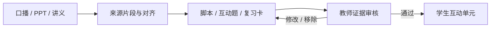

# jiaowu2K26 · AdventureX 现场构建计划（未开始）

> 当前目录没有功能实现。本文件只用于正式开赛后的任务拆分；任何技术选择都应在现场确认规则后执行。
> 项目层级：jiaowu2K26 是总项目；本计划优先构建其首个 P0 模块“智课工坊”，再用最小 MyCareer 外壳说明总项目。

## 当前拥有的只是材料

- `archive/`：重构前的原始散稿、旧 PPT、旧静态页面和历史信息；
- `data/`：空白现场数据入口，正式开赛后再创建输入、输出与评测；
- `docs/`：产品假设、目标路径和工作计划；
- `design/`、`pitch/`、`submission/`：现场待办和写作框架。

上述内容都不等于可运行基线。尤其是归档中的旧静态页面，不应复制成现场作品的起始代码；历史样例能否用于参赛实现，也应先按当届规则确认。

## 现场目标架构

这是目标流程图，不代表其中任何节点已经实现。

这条流程是 jiaowu2K26 的第一个纵向切片，不是总项目的完整功能树。总项目模块见 [features/TODO.md](features/TODO.md)。

## 数据合同候选

现场可从最小结构开始：

- 生成对象：唯一 ID、类型、内容、来源 ID、审核状态、编辑历史、发布状态；
- 来源对象：材料 ID、类型、页码或时间段、原文跨度、版本；
- 审核事件：对象 ID、动作、时间、操作者、修改前后内容；
- 运行记录：输入版本、模型或规则版本、校验结果、失败原因、是否回退。

历史数据结构已归档在 `archive/original-materials/demo-pack/`。若规则不允许参考赛前数据，就不要导入现场仓库，直接在现场创建全新样例。

## 72 小时建议节奏

### 0–6 小时：合规与空白基线

- 再读当届规则，确认可使用的资料范围；
- 新建代码仓库和首个空白提交；
- 记录环境、成员和任务分工；
- 选定一个有公开权利的现场样例；
- 定义最小数据合同和完成标准。
- 为候选开源依赖记录上游、精确版本、许可证与用途；
- 对 Rust / OceanBase 主路径进行最小小样，在第 6 小时前决定通过或回退。

### 6–18 小时：材料到一个对象

- 提取一页 PPT 或一段讲义；
- 保存可定位的来源片段；
- 生成或手工构造一个符合合同的对象；
- 做 schema 校验和错误提示。

### 18–36 小时：教师审核闭环

- 展示对象及其来源；
- 实现修改、通过和移除；
- 保存审核事件；
- 确保未通过对象不能发布。

### 36–48 小时：学生最小体验

- 发布一个通过的对象；
- 完成一题理解检查和一张复习卡；
- 补空状态、失败状态和回退路径；
- 在至少两种屏幕尺寸上测试。
- 用一个最小赛季/课程卡入口将闭环包裹为 jiaowu2K26 体验，不在此阶段扩建全部生涯模块。

### 48–60 小时：真实任务观察

- 邀请 3–5 位老师或课程制作者走完整流程；
- 记录审核时间、误解点和修改内容；
- 优先修复阻断闭环的问题；
- 不用小样本推导学习效果或市场结论。

### 60–72 小时：稳定与路演

- 用一份新材料做冷启动；
- 固化现场允许的离线回退；
- 在现场生成截图、录屏和最终 PPT；
- 按提交清单检查密钥、隐私、时间戳和对外表述。

## 技术候选，不是既定实现

- **前端候选**：React + Vite Web；WinUI 3 仅作有条件 Secondary；
- **服务候选**：Rust + Axum + Tokio 模块化单体，未过 6h 闸门则切换团队熟悉的单 API；
- **存储候选**：OceanBase MySQL 模式 + SQLx 条件主选，SQLite / JSONL 作为相同领域接口下的回退；
- **模型策略**：模型可替换，数据合同和审核链不绑定供应商；
- **隐私策略**：最小化上传，不把材料、个人数据或密钥写进仓库。

详细闸门见 [TECH-STACK.md](TECH-STACK.md)，开源复用登记见 [tech-stacks/OPEN-SOURCE-REUSE.md](tech-stacks/OPEN-SOURCE-REUSE.md)。

现场应按团队能力和赛道要求取舍，不必为了匹配这份文档而强行采用某个栈。

## Definition of Done

一项功能只有同时满足以下条件，才可在路演中称为“完成”：

1. 在 AdventureX 正式开赛后实现并有提交记录；
2. 有真实可操作路径，而不是概念图；
3. 有失败状态或明确回退；
4. 有可复查输入、输出和测试记录；
5. 对外表述不超过现场实现边界。
6. 实际引入的开源组件有完整版本、许可和归属记录。
