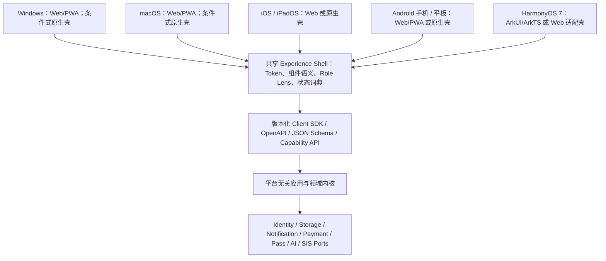
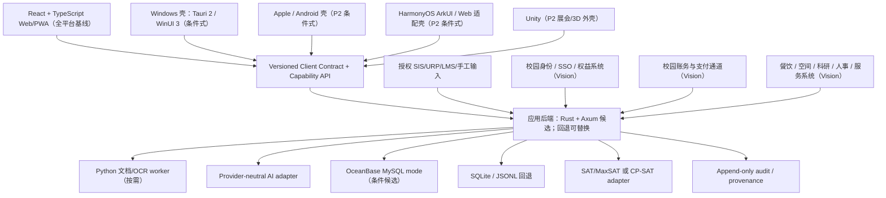

# 目标架构

> 本文件定义 jiaowu2K26 的目标架构，也是“01 基座”的兼容性宪章。所有技术决策在开赛后 6 小时内通过 GATE-1 验证，未通过则切换到回退方案；赛前只定合同，不提前构建。

## 架构风格

**模块化单体（Modular Monolith）** —— 不是微服务、不是 Kubernetes。

模块之间用稳定领域对象、应用端口和内部接口隔离，而不是拆成网络服务。若 GATE-1 选择 Rust，trait 是内部实现手段；跨客户端、跨学校和长期兼容的真相必须同时由 OpenAPI / JSON Schema / 事件 Schema 表达，不能只存在于 Rust 类型里。只有文档提取、外部模型和硬件这类天然异构能力通过进程/API 边界连接。

理由：
- 72 小时黑客松不适合微服务部署和调试复杂度
- 模块化单体足够支撑 P0 + 1 个 P1 的数据量
- 模块边界清晰，未来可拆，但现在不拆

前端同样采用**一个 Experience Shell**：MyCareer、Coach Studio 与 Front Office 只以 Role Lens 切换权限、默认任务和信息密度，不能各自建立组件库或视觉主题。

## 01 基座兼容性宪章

**决定：Windows-first validation，cross-platform by contract。** 第一版优先在 Windows 浏览器/PWA 和最终演示机验证，不等于采用 Windows-only 架构。macOS、iOS、iPadOS、Android 手机/平板与 HarmonyOS 7 后续客户端都消费同一领域合同、状态机、设计 Token 和服务端 API。

### 不可破坏的九条规则

1. **领域内核无平台类型：** 核心实体、规则、审核、账本和求解器不得引用 WinUI、DOM、WebView、SwiftUI、Android、ArkUI 或游戏引擎对象。
2. **合同先于界面：** OpenAPI / JSON Schema / 事件 Schema、示例 Fixture 和错误语义先确定，客户端从合同生成或验证类型，不手抄第二份字段真相。
3. **Ports & Adapters：** 文件、相机、通知、支付、门禁、身份、数据库和模型均从能力端口进入；平台壳只实现适配器。
4. **能力检测而非系统判断：** 业务询问 `camera.capture`、`pass.present`、`offline.queue` 等 capability，不写“如果是 Windows/Android 就……”的业务分支。
5. **兼容优先：** 同一主版本内只做可忽略的新增字段；客户端必须容忍未知字段和未知枚举并降级为 `unknown`，不能崩溃或误判。
6. **数据迁移有窗口：** 破坏性变更必须提升主版本、提供显式迁移与旧读路径；数据库采用 expand → migrate → contract，不能一步删字段。
7. **跨端语义一致：** 正式名称、状态、证据、错误、权限和核心功能完全一致；触控、鼠标、键盘、读屏只改变交互方式。
8. **国际化与精度明确：** UTF-8、ISO-8601、UTC + 原时区、稳定不透明 ID；货币使用最小单位整数或定点字符串，不能用浮点数；路径和 ID 不保存平台分隔符。
9. **Golden Contract Tests：** 每个已发布合同保留黄金 Fixture、往返序列化、旧版本读取、离线重放与多客户端一致性测试；只有赛中代码仓建立后才实现这些测试。

首个 HTTP 合同统一从 `/api/v1/` 开始；所有当前模块 Prompt/Spec 已在赛前规格层统一该前缀。以后不得在同一服务里同时出现含义相同的无版本 `/api/*` 与 `/api/v1/*` 路径。

### 分层与迁移路线



| 平台 | 首选路径 | 后续原生能力 | 约束 |
|---|---|---|---|
| Windows | React Web/PWA | 只有系统集成确有价值时再选 Tauri 2 或 WinUI 3 壳 | WinUI 不承载领域规则 |
| macOS | 响应式 Web/PWA | 可评估 Tauri 2 / Swift 壳 | 与 Windows 共用 API、Schema、Token |
| iOS / iPadOS | 响应式 Web；商店版另行评估 | Tauri 2 / Swift 壳；通知、文件和生物识别走 capability adapter | 不承诺所有 PWA 能力等同桌面 |
| Android 手机 / 平板 | 响应式 Web/PWA | Tauri 2 / Kotlin 壳 | 平板布局是同一 Shell 的响应式变体 |
| HarmonyOS 7 手机 / 平板 | 浏览器/Web 适配或 ArkUI Web 组件验证 | ArkUI/ArkTS 壳通过标准 API 接入 | Tauri 不视为 HarmonyOS 官方支持；独立做兼容验证 |

Tauri 2 官方定位覆盖主要桌面与移动平台，可复用 HTML/CSS/JavaScript 前端并在需要时调用 Rust、Swift、Kotlin；它是**候选壳**而不是已批准依赖。HarmonyOS 的官方 ArkUI 提供声明式 UI 及 Web 内容承载能力，因此采用单独适配器，不假设 Android 包可直接等价迁移。参考：[Tauri 2](https://v2.tauri.app/start/) · [HarmonyOS ArkUI](https://developer.huawei.com/consumer/cn/arkui/)。

## 系统上下文图



外部系统关系：
- **SIS/URP/LMS**：只读数据源，授权导入，不写回
- **AI 模型服务**：草稿生成，结构化输出，可替换
- **全平台客户端**：学生、教师和学校角色消费同一版本化合同；浏览器/PWA 是基线，原生壳只增加经授权的平台能力
- **校园身份/门禁**：只通过受控适配器镜像或提交已授权请求；不保存原系统密码或门锁密钥
- **校园账务/支付通道**：General Balance 只做分账视图、预算与交易编排；真实资金由持牌/校方系统执行
- **餐饮/空间/科研/人事**：作为可替换权威来源；建议、What-if 和 Case 状态不得冒充正式决定

## 内部模块边界

| 模块 | 职责 | 禁止渗透 |
|------|------|----------|
| `identity` | 演示身份、角色与最小权限 | UI 路由不能代替后端鉴权 |
| `content` | Material、SourceFragment、GeneratedObject、版本 | 不保存供应商专属响应为领域真相 |
| `review` | 修改、通过、移除、发布状态机 | 未通过对象不得被 UI 绕过发布 |
| `academic_mirror` | 外部数据、权威等级、时效、冲突 | 不冒充 SIS，不默认写回 |
| `resolver` | CourseSpec、pins、约束、方案、解释、lock | 不把个人规划与全校排课混成一个模型 |
| `career` | 赛季、课程阵容、目标、里程碑和事件引用 | 不复制其他模块的业务数据 |
| `opportunity` | 机会、资格、同意、权益和进度镜像 | 不自动投递、不付费排序 |
| `experience_shell` | 全局导航、Role Lens、Design Tokens、状态词典、Replay 与模式偏好 | 模块不能私有换肤或复制全局状态 |
| `identity_entitlement` | 身份关联、Pass、范围、前置条件、期限、申请与撤销镜像 | 不自行签发门禁、不保存门锁密钥、不做移动画像 |
| `wallet_ledger` | 分账、交易镜像、政策资金、模块预算、对账与争议状态 | 不混账、不存卡数据、不替代真实清算系统 |
| `policy` | 资格、资金用途、访问范围、例外与版本化解释 | AI 文案不能覆盖确定性规则或权威审批 |
| `dining` | 菜单、过敏原、价格、供应、建议与聚合运营信号 | 不猜测食材、不做医疗诊断或个人浪费排名 |
| `faculty_success` | 教学/科研证据、机会、合规、年度档案与晋升材料 | 不自动作出人事、伦理或晋升决定 |
| `institution_ops` | 服务 Case、资源读模型、机构场景、政策 What-if 和治理 | 不建立第二权威库、不以黑箱分数处分个人 |
| `client_contract` | OpenAPI/JSON/Event Schema、Capability、兼容版本与 Golden Fixture | 不保存某客户端私有类型，不让未知字段误触发高风险动作 |
| `portability` | 可读导出、可信归档、签名/加密元数据、隔离导入与迁移 | 不把可读包冒充证明，不直接覆盖权威记录，不自研密码算法 |
| `federation` | 租户、机构信任、能力发现、outbox/inbox、幂等同步与冲突对账 | 不集中默认复制敏感原始数据，不用 last-write-wins 覆盖权威事实 |
| `providers` | 模型、OCR、存储、SIS、求解器适配器 | 供应商 SDK 不进入核心实体 |
| `audit` | 运行、审核、发布、开源与数据使用证据 | 审计数据也受最小权限与保留期限 |

对应 `modules/` 目录的功能模块映射：
- `00-smartcourse/` → content + review（P0 智课工坊）
- `01-mycareer-shell/` → career + identity
- `02-academic-mirror/` → academic_mirror + federation（P2 部署扩展）
- `03-roster-lab/` → resolver
- `04-world-exam/` → content（考试生成）
- `05-opportunity-market/` → opportunity
- `06-performance-center/` → audit + career
- `07-coach-scouting/` → providers + review
- `08-campus-life/` → career（P2 展会外壳）
- `09-university-os/` → identity_entitlement + wallet_ledger + policy + dining + faculty_success + institution_ops（F-010～F-014 合并式长期扩展包）

`client_contract`、`portability`、`federation` 和 `audit` 是共享基座，不新增顶层 F 模块；F-001 从第一条纵向切片开始遵守合同，X-11 在后续阶段实现完整双归档。

## 数据流

### P0 智课工坊核心数据流

```
材料上传 → content 提取（SourceFragment）
         → AI 草稿生成（GeneratedObject + source_ids）
         → 审核状态机（draft → approved/removed）
         → 发布（仅 approved 版本）
         → 学生互动（理解检查、答题）
         → Replay / Box Score（来源与审核回溯）
```

### Academic Mirror 数据流

```
SIS/URP/LMS → fetched_at + authority_level
            → normalized_payload
            → conflict resolution
            → 只读镜像（不写回源系统）
```

### Semester Resolver 数据流

```
CourseSpec + SemesterPrefix + Pins + CatalogVersion
                         ↓
              dependency/conflict graph
                         ↓
          hard constraints + ordered preferences
                         ↓
 candidate plans + unsat explanation + unknowns
                         ↓
       diff + transaction preview + semester.lock
```

### General Balance 数据流（Vision）

```text
校园账务 / 政策资金 / 支付通道回执
              ↓ 受控 adapter + 来源/版本/时效
      append-only 分账读模型
              ↓
Policy Rule + 用户 Module Cap + 例外规则
              ↓
交易预览（资金来源、限制、剩余、失败原因）
              ↓ 用户确认 / 强认证在通道侧完成
    权威系统执行 → 回执 → 对账 / 退款 / 争议镜像
```

General Cash、Policy Balance、External Rails、Module Cap 和 Entitlement 使用不同领域类型。External Rails 不提供完整外部余额，真实资金移动也不由 AI 模型执行。

### Campus Pass 数据流（Vision）

```text
权威身份 / 课程 / 岗位 / 安全培训
              ↓
 Entitlement 资格解释与申请预览
              ↓ 本人/责任人确认
正式校园系统批准、签发、撤销或拒绝
              ↓
状态镜像 + 有期限离线凭证元数据 + 自查/纠错
```

### Institution Scenario 数据流（Vision）

```text
多权威系统 → Academic Mirror / 有血缘读模型
           → 聚合与最小化
           → 约束 + 假设 + 多方案
           → 受影响群体 / 权衡 / 未知
           → 人工审议与批准
           → 正式系统外部执行 + 结果 Replay
```

### 个人双归档数据流（X-11，P2 完整）

```text
本人选择范围 + 有效同意 + 当前权威/来源信息
                      ↓
              Export Projection
               ↙             ↘
人类可读非权威包                 可信可携带包
HTML/JSON/CSV/PDF              canonical manifest + payload hashes
明显标注非正式                  issuer signature + key id
不进入自动可信导入              optional authenticated encryption
                                      ↓
                         隔离区验证 → 迁移 → 对账/人工确认
                                      ↓
                         恢复个人状态或形成候选镜像
```

“加密”只提供机密性，**不能证明数据是谁签发、是否被篡改**；可信归档必须有发行方数字签名和受信密钥链，可选再加密。即使验证通过，也不能直接覆盖学校的正式成绩主记录。

### 学校主权联邦数据流（P2 / Vision）

```text
学校 SIS / LMS / 财务 / 身份（权威）
             ↓ 校内 Sovereign Node
     校方策略、密钥、原始/敏感数据
             ↓ 最小化、签名、可撤销同步
共享 Control Plane / 主服务
Schema 与信任注册、路由、同意回执、最小读模型
             ↓
学生多端 Experience Shell + 本人归档
```

- **学校数据平面：** 校方可选择本地、校内云或批准区域部署；保存权威原始记录、校方密钥、策略和审计。
- **共享控制平面：** 保存版本 Schema、机构/密钥信任注册、能力发现、路由、最少必要的用户体验数据和经协议允许的加密副本；默认不集中复制全部原始成绩。
- **主服务保存成绩的语义：** 可以保存经校方授权的加密只读镜像或缓存，但必须标为 `replica/cache`；除非校方正式指定，不得把它标成权威主记录。
- **离线与分区：** 学校节点在主服务不可用时仍可读本校权威数据和排队同步；恢复后使用幂等事件对账，不以“最后写入者获胜”覆盖正式成绩。
- **P0 边界：** 只用单租户 Fixture + SQLite 验证相同合同；不接真实学校系统，也不提前实现跨校分布式部署。

## 跨模块执行契约

以下合同来自本地成品项目的纠错、离线队列、状态机和 Replay 经验，用于实现 EXP-CASE-01/02/07。它们是共享基础设施，不得由各模块各造一份。

### 1. Human Override / AI Result Envelope

模型只能生成候选结果，不能直接发布课程内容、写回学籍、移动资金、签发门禁、发布政策或作出人事决定。每个可行动结果至少携带：

~~~text
result_id
result_type
source_ids[]
evidence_status: supported | partial | insufficient | conflicting
confidence_basis[]       # 依据，不用孤立百分比代替解释
unknowns[]
alternatives[]
generation_mode: model | rule | fixture
model_or_rule_version
review_status
fallback_used
expires_at
~~~

统一处理顺序：

~~~text
draft
  → machine_checked
  → needs_review
  → approved / rejected / needs_correction
  → published_or_externally_executed
  → reconciled / withdrawn / appealed
~~~

低风险学习建议可由本人确认采用；教师发布、学校治理、支付、门禁、录取、资助、医疗、纪律与人事事务必须进入对应责任人或确定性 Policy Engine。

### 2. Academic Replay / Evidence Pack

Replay 不是一段总结文案，而是一组可复查事件。所有关键流程共用最小 Evidence Pack：

~~~text
event_id
subject_type + subject_id
actor_id + actor_role
action
before_state + after_state
reason
source_refs[]
policy_model_solver_versions[]
occurred_at
visible_summary
correction_or_appeal_route
retention_and_visibility
~~~

同一 Evidence Pack 可渲染为学生 Replay、教师课程改进回放、General Balance 对账、Campus Pass 状态历史或学校政策 What-if 记录；视图不同，底层事件身份不变。

### 3. 高风险事务状态机

F-010、F-011 与 F-014 的动作统一使用：

~~~text
Draft → Pending → Reviewed → Approved → Externally Executed → Reconciled
                    ├→ Rejected
                    ├→ Expired
                    └→ Fault → Retry / Manual Handoff / Appeal
~~~

- 每次重试带幂等键，不能重复扣款、重复申请或重复发布。
- UI 必须显示责任方、当前状态、最后更新时间、下一步和人工渠道。
- 外部权威系统没有回执时只能显示 Pending/Unknown，不能先行宣称成功。

### 4. Intent Profile 与权威事实分离

目标、兴趣、节奏、叙事偏好和本人约束属于用户控制的 Intent Profile，不属于 Academic Mirror 的权威事实。它必须可查看、纠正、导出、删除和设置失效时间；不得把长期意图历史变成秘密 OVR、录取/资助依据或不可撤回身份标签。

### 5. 离线操作队列

允许离线的写操作保存为本地待处理请求，状态至少包含 pending / processing / succeeded / fallback / failed / cancelled；恢复网络后按幂等键重放。涉及支付、门禁和正式审批的请求只能排队或跳转权威渠道，不能在离线端伪造成功。

### 6. Personal Data Archive / 双归档合同

#### A. Human-readable Export（非权威）

推荐为普通 ZIP，至少包含：

```text
README.txt                 # 范围、生成时间、非权威警示、求助入口
index.html                 # 离线可阅读入口，不加载远程脚本
manifest.json              # Schema、来源、版本、文件哈希、遗漏项
data/*.json                # 机器可读事实与用户内容
tables/*.csv               # 便于本人查看和迁移
documents/*.pdf            # 可选的人类可读报告
licenses-and-sources/      # 用户创建内容与可随包分发材料的说明
```

- 文件必须能在离线环境阅读，且每个事实保留来源、发行方、权威等级、获取时间和版本。
- 顶部明确写“个人副本 / 非正式证明 / 不用于自动可信导入”。
- 不包含密码、访问令牌、模型密钥、门锁密钥、完整银行卡数据、教师内部备注或无权转发材料。
- 若部分数据依法或因第三方权利不能导出，Manifest 必须列出类别和原因，不能静默缺失。

#### B. Portable Trusted Archive（可校验、可选加密）

容器扩展名可在实现前决定，内部使用公开、版本化结构而不是不可读私有二进制。最小 Manifest：

```text
archive_schema_version
archive_id
issuer_id + issuer_type
subject_id / portable_subject_ref
issued_at + expires_at?
authority_scope[]
source_systems[]
payload_files[]: path + media_type + sha256 + schema_id
consent_receipt_ref
signature_profile + key_id
encryption_profile? + recipients?
migration_history[]
```

安全语义：

1. JSON 进入哈希/签名前采用确定性规范化；候选标准是 [RFC 8785 JSON Canonicalization Scheme](https://www.rfc-editor.org/rfc/rfc8785.html)。
2. Manifest 至少由发行方数字签名；JWS 是候选封装之一（[RFC 7515](https://www.rfc-editor.org/rfc/rfc7515.html)）。
3. 需要机密性时使用经过审计库提供的认证加密；JWE 是候选封装之一（[RFC 7516](https://www.rfc-editor.org/rfc/rfc7516.html)）。算法套件、密钥托管与恢复必须在正式威胁模型后选定，文档阶段不自创密码算法。
4. 发行私钥只存在于机构 KMS/HSM 或批准密钥设施；客户端包、仓库、日志和导出文件均不得含私钥。公钥有 `key_id`、有效期、轮换与撤销状态。
5. 用户自行修改后即使重新加密，也不再继承原发行方可信状态；个人可追加自己的说明，但不得伪装成学校签名。

受控导入顺序固定为：

```text
安全解包与大小/路径限制
→ Schema 与媒体类型检查
→ 文件哈希
→ 签名、发行方、密钥有效期与撤销检查
→ 按需解密与身份/同意检查
→ 兼容版本迁移
→ 隔离区预览 + 冲突/权威对账
→ 本人或责任人确认
→ 导入为恢复状态、候选镜像或拒绝
```

导入器禁止路径穿越、压缩炸弹、外部实体、宏和归档内可执行内容；未知主版本拒绝自动导入并提供人类可读说明。正式成绩、财务、门禁与人事记录只能由对应权威发行方恢复为权威状态；其他有效包最多成为有来源的候选证据。

### 7. Sovereign Federation / 学校主权联邦合同

每条跨节点记录或事件至少携带：

```text
event_id + idempotency_key
tenant_id + home_institution_id + issuer_id
subject_ref
record_type + schema_version
authority: authoritative | delegated | replica | cache | user_asserted | fixture
source_revision + occurred_at + observed_at
purpose + consent_or_legal_basis_ref
payload_hash + signature_ref
retention + visibility
supersedes? + correction_or_appeal_route
```

联邦同步规则：

- 使用 outbox/inbox 和幂等消费；重复、乱序与延迟事件不得造成重复写入或状态倒退。
- 权威冲突按 `record_type + issuer + authority policy + source_revision` 进入对账，不使用通用 last-write-wins。
- 多租户数据在查询、缓存、对象存储、日志、备份和密钥范围同时隔离；`tenant_id` 不是唯一安全边界。
- 同步只传当前目的需要的数据；原始门禁轨迹、完整消费流水、健康和人事资料默认不出学校节点。
- 撤回同意、修正、过期和删除也必须作为可传播事件处理；备份保留期和法律例外要可解释。
- 中央服务和学校节点都暴露版本/能力清单；双方没有共同兼容版本时明确停止写同步，不能猜字段。
- 学校可退出联邦并导出本校配置、密钥引用、审计和允许迁移的数据；不能被单一云供应商锁死。

## 数据合同

### 内容与审核

```json
{
  "source_fragment": {
    "id": "src-001",
    "material_id": "lec-01",
    "type": "slide | transcript | handout",
    "locator": "P.12 | 03:45-04:12 | text-span",
    "text": "...",
    "source_version": 1,
    "rights_status": "authorized_demo"
  },
  "generated_object": {
    "id": "obj-001",
    "type": "quiz | review_card | script",
    "source_ids": ["src-001"],
    "generation_mode": "model | rule | fixture",
    "review_status": "draft | approved | removed",
    "published_version": null
  },
  "review_event": {
    "object_id": "obj-001",
    "action": "edit | approve | remove | publish | withdraw",
    "actor_id": "teacher-01",
    "timestamp": "ISO-8601",
    "reason": "...",
    "changes": {}
  }
}
```

### Provider 响应信封

```json
{
  "provider": "event-confirmed-provider",
  "model_or_rule_version": "exact-id",
  "input_hashes": ["sha256:..."],
  "source_ids": ["src-001"],
  "structured_output": {},
  "schema_valid": true,
  "started_at": "ISO-8601",
  "latency_ms": 0,
  "fallback_used": false,
  "error": null
}
```

各模块详细数据合同见 `modules/` 下各模块的 SPEC.md。

## 数据不变量

1. 无可定位来源的 AI 对象不能进入教师审核
2. 只有 `approved` 的具体版本可发布
3. 审核、发布、撤回和数据使用事件只追加
4. 外部记录始终带来源、版本、获取时间和权威等级
5. What-if 与正式结果在数据类型和界面文案上同时区分
6. 求解结果必须包含依据、未知、未满足和相对当前方案的 diff
7. 模型/数据库/供应商 ID 不进入核心领域枚举，保持可替换
8. 演示 fixture、缓存结果和实时结果不可共用同一状态标签
9. 全部页面消费同一 Experience Shell 和 Design Tokens；Role Lens 不能产生第二套视觉真相
10. General Cash、Policy Balance、External Rails、Module Cap 与 Entitlement 不得共享可互换余额类型
11. 支付、门禁、录取、资助、医疗、纪律、人事和晋升决定必须由权威系统/责任人作出
12. 高风险建议始终包含来源、规则版本、未知、替代项、申诉和人工回退
13. 机构分析使用最小化/聚合读模型，不以个人通行、消费、健康或绩效数据建立公开排行榜
14. AI/规则候选结果必须使用统一 Result Envelope；模型文本不能绕过审核或确定性策略直接改变权威状态
15. 关键事件必须生成稳定 Evidence Pack，保留操作者、前后状态、理由、来源、版本、时间和纠错/申诉路径
16. 高风险事务只能沿显式状态机迁移；外部回执缺失时不得从 pending/unknown 推定成功
17. Intent Profile 与权威记录、模型推断分型存储；用户可纠正、导出、删除和设置到期
18. 所有可重试外部操作具备幂等键、可观察失败和人工接管，不允许静默重复执行
19. 领域对象、状态机和权限规则不得依赖任一客户端框架或操作系统类型；平台能力只能经 adapter 进入
20. 已发布合同同一主版本内保持向后兼容；未知字段可忽略、未知枚举降级为 unknown，不能误映射为已知高风险状态
21. Windows、Web、Apple、Android、HarmonyOS 与未来客户端对同一状态、错误、证据和权限使用同一 Schema 与语义
22. 可读归档始终标为非权威；可信归档必须验证发行方签名，单独加密不能产生可信性
23. 可信归档导入先进入隔离、迁移与权威对账，不能直接覆盖学校正式成绩或其他权威记录
24. 学校 SIS/LMS/财务/身份等记录的权威归属由校方与正式制度决定；主服务副本必须明确标为 replica/cache
25. 联邦同步按目的最小化、租户隔离、签名、幂等、版本协商和显式冲突策略执行；禁止通用 last-write-wins 覆盖权威事实
26. 用户意图、应用互动、学校权威记录和模型推断分别标注发行方与 authority；跨域使用必须重新取得依据
27. 私钥不进入客户端、仓库、日志或归档；密钥轮换、撤销与旧归档验证必须有可测试路径

## 部署架构

| 场景 | 方式 | 回退 |
|------|------|------|
| 本地开发 | localhost + SQLite | — |
| 现场 Demo | Zeabur 或 localhost | 纯前端 + JSONL 文件 |
| 网络故障 | PWA 缓存 + 本地服务 | Golden output 文件直接加载 |
| 全面故障 | 截图 + PPT 讲解 | 预先录制的 90 秒视频 |
| 单校生产候选 | 校方批准区域的 Sovereign Node + 可选共享控制平面 | 校内独立运行 + 延迟同步 |
| 多校联邦候选 | 每校独立数据平面 + 版本化/签名事件互联 | 停止写同步、保留本校服务并人工对账 |

### 部署原则

- Local-first：核心服务必须能在演示机独立运行
- 演示不能依赖唯一公网路径
- 所有回退方案共享同一 repository 合同
- 密钥只放受控环境变量，不回显、不提交
- Windows-first 只描述首个验证环境；任何正式发布平台都必须通过同一合同、Golden Fixture、离线和可访问性验收
- 生产联邦、可信归档算法套件和真实学校数据接入必须在黑客松后另做安全、隐私、合规、密钥与灾备评审
