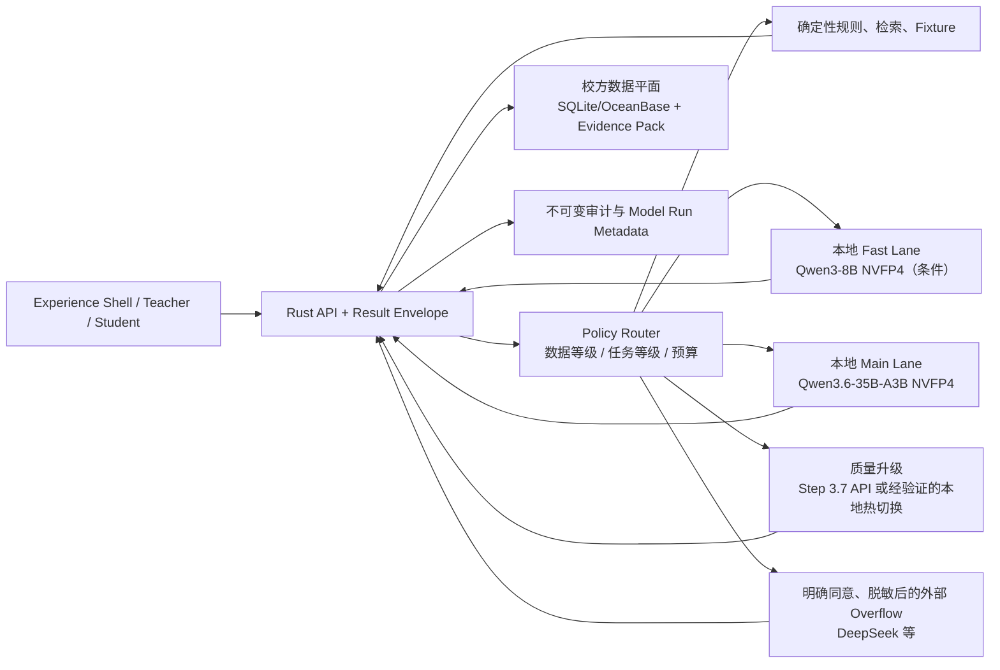

# 大学2K26 / University2K26 · GX10 本地主权 AI 节点

> **状态：** `v0.2 adapter implemented / device unverified`；Provider-neutral OpenAI-compatible adapter、来源约束合同和规则回退已实现，尚未在借用设备上运行任何模型。
> **目标：** 把 ASUS Ascent GX10 用作本地模型服务与“单校 Sovereign Node”演示节点，同时保持 Provider-neutral、Fixture 回退和学校数据主权。
> **当前选择：** 今晚的可执行默认是 NVIDIA 已在同类 GB10 / 128GB 设备上给出配方的 `Qwen3.6-35B-A3B-NVFP4`；双模型只在实测后启用，Step 3.7 Flash 先作为赞助平台质量通道与极限本地 Spike，不作为 P0 启动依赖。
> **云端临时通道：** Moonshot BYOK 默认使用 `kimi-k2.6` 的非思考快速档；K3 仅保留为人工显式切换的高成本兼容项，不进入默认路由。
> **更新时间：** 2026-07-25

---

## 1. 设备事实、用户报告与未知

| 项目 | 当前信息 | 证据状态 |
|---|---|---|
| 处理器 | NVIDIA GB10，Arm v9.2-A CPU + Blackwell GPU | ASUS 官方规格 |
| 内存 | 128GB LPDDR5x 统一内存 | ASUS/NVIDIA 官方规格 |
| 存储 | 官方有 1TB PCIe 4.0 与 4TB PCIe 5.0 配置 | ASUS 官方规格 |
| 网络 | 10GbE、ConnectX-7、Wi-Fi 7 | ASUS/NVIDIA 官方规格 |
| 软件 | Ubuntu / DGX OS 系，Docker + NVIDIA Runtime、NGC、Dashboard/Jupyter 等 | 官方文档 |
| 本台设备 | 用户报告为 128GB + 1TB，已获得使用机会 | **尚未由仓库脚本实机核验** |

关键边界：

- GB10 是 Arm64；只提供 x86-64 镜像、wheel 或二进制的依赖可能不能运行。
- “支持最高 200B 参数”是按特定量化、上下文与运行时条件的上限，不等于任意 200B 模型都能舒适常驻。
- 统一内存同时服务操作系统、模型权重、KV cache、容器和其他服务；不能把 128GB 全算给权重。
- 1TB 版本不适合长期保存许多前沿模型副本。默认至少预留 200GB 给系统、容器、数据、日志和回滚；模型缓存软上限 600GB，超过必须人工清理。

## 2. 目标拓扑



“大模型 + 小模型”不是把两套聊天机器人摆在 UI 上，而是内部路由：

1. 能由确定性规则、全文检索或已有 Fixture 完成的，不调用模型。
2. 低风险分类、格式化、短摘要可走 Fast Lane。
3. 需要中文推理、工具调用、长材料整合与结构化草稿走 Main Lane。
4. 只有明确的质量阈值未通过才升级；高风险结果无论模型大小都进入人工审核。
5. 学校敏感数据默认不离开 Sovereign Node；外部 Overflow 只接收得到许可且完成最小化/脱敏的内容。

## 3. 模型事实对比

以下只比较“在单台 128GB GX10 上作为本地服务”的现实可行性，不代表通用能力排行榜。

| 候选 | 已核验公开事实 | 单机判断 | 本项目位置 |
|---|---|---|---|
| `Qwen3.6-35B-A3B-NVFP4` | NVIDIA 提供 DGX Spark 单机 vLLM/llama.cpp 配方、OpenAI-compatible API；示例约需 40GB 磁盘并为模型/KV 留约 30GB 空闲内存 | **最稳** | 今晚 Main Lane |
| `Qwen3-8B-NVFP4` | NVIDIA Spark vLLM 支持矩阵列出 | **可行，需实测质量** | 条件 Fast Lane；若价值不足可只用 Main |
| Step 3.7 Flash | 198B 稀疏 MoE、约 11B 激活、256k、Apache-2.0；官方 GGUF Q4_K_S 111.5GB + 视觉 projector 3.97GB + 约 7GB overhead，推荐 128GB 统一内存 | **能否稳定服务非常紧，必须实测** | 赞助 API 质量通道；本地只做独立极限 Spike |
| DeepSeek V4 Flash | 284B 总参数、13B 激活、1M context、FP4+FP8 mixed、MIT | **权重/运行开销超过舒适单机预算** | 仅外部 opt-in overflow；不作本地主模型 |
| Kimi K3 | Moonshot 已提供官方云端 API 型号与 1M 上下文说明；截至复核日未找到可供 GX10 本地部署的公开权重 | **云端可用，本地不可选** | 不进默认路由；仅在明确批准高成本升级时人工选择 |
| Kimi K2.6 | Moonshot 官方 API 支持 256K、文本/视觉、思考与非思考模式；可用 `thinking={"type":"disabled"}` 关闭思考 | **云端可用，本地权重未证实** | 当前 BYOK Fast 默认；只接收获准的最小化数据 |
| Kimi K2.5 | 1T 总参数、32B 激活、原生 INT4 | **远超单机** | API/未来多节点研究，不进 P0 |
| GLM-5.2 | 官方模型卡约 753B、BF16、1M | **远超单机** | API/未来集群，不进 P0 |
| Qwen 3.7 / 3.8 | 已核验到托管的 3.7 Max 信号；未核验到适合本地的官方 3.8 权重 | **不以名字猜部署** | 等官方模型卡、许可证与 Spark 配方 |
| MiniMax M3 | 428B 总参数、23B 激活、1M；官方/合作量化仍远大于舒适单机预算 | **不适合单台 128GB 常驻** | API 候选，不进本地 P0 |

### 选择

如果现在只能选一个：**`Qwen3.6-35B-A3B-NVFP4`**。

这不是声称它“全球能力第一”，而是它在本台设备约束下具有最强的可执行证据：同类 GB10/128GB 单机、ARM64、vLLM 与 llama.cpp 都有 NVIDIA 配方，能暴露 OpenAI-compatible API，失败时也容易回滚。

若用户批准双模型实验：

- `Qwen3-8B-NVFP4`：短请求与路由；
- `Qwen3.6-35B-A3B-NVFP4`：主推理；
- Step 3.7 Flash：先使用赛事赞助 API；本地 GGUF 只在独立进程、缩短 context、清空其他模型后测试，不与主服务同时承诺。

“Kimi K3 + DeepSeek V4 Flash”仍不作为默认组合：前者虽已是官方云端型号，但费用高且没有 GX10 本地权重证据；后者不适合在单台 128GB 节点舒适常驻。当前云端验证统一走 `kimi-k2.6` 非思考快速档，本地主权节点仍按实机证据选择公开权重。

## 4. 任务路由

| 任务 | 默认执行者 | 升级条件 | 人类门禁 |
|---|---|---|---|
| 权限、先修、资金用途、审核状态 | Rust Policy/Rule | 不升级到模型裁决 | 正式规则 owner |
| 资料切片、关键词检索 | 本地确定性 worker | 召回不足才评估 embedding | 来源必须可定位 |
| 短摘要、标签、格式校验 | Fast Lane/规则 | Schema 连续失败转 Main | 教师发布前审核 |
| 带来源教学草稿、问题生成 | Main Lane | 质量 rubric 未通过转 Step/人工 | 教师修改/批准 |
| 复杂规划建议 | Main Lane + solver | 约束冲突或证据不足转人工 | 用户确认；不写回 SIS |
| 学校政策/人事/支付/门禁 | 模型只解释备选 | 不能升级为模型决定 | 对应责任人/系统执行 |
| 外部模型 | 默认禁用 | 明确同意、最小化、脱敏、区域/条款允许 | 记录审批和数据范围 |

所有模型响应进入统一 Result Envelope，至少记录：

```text
run_id
provider + model_id + revision
generation_mode
input_classification
source_ids[]
evidence_status
unknowns[]
schema_validation
fallback_used
latency_ms
review_status
retention_policy
```

## 5. Sovereign Node 安全边界

- 模型服务不能直接连接生产数据库；由 Rust 应用层提供最小工具和字段。
- 每校独立 tenant、密钥、策略、日志与数据保留；跨校同步只发送获准的版本化事件。
- 原始成绩、门禁、消费、健康、人事与未发布课程材料默认禁止发往外部 API。
- 工具调用使用 allowlist、超时、输出 Schema、幂等键与最小权限；文件/命令执行进入容器或 sandbox。
- Prompt、检索片段、输出和工具结果按数据等级设定保留期；日志不回显密钥与直接身份标识。
- 模型权重、容器镜像、量化版本和许可证写入 `DEPENDENCIES.md` 后才能成为项目依赖。
- 服务不可用时返回明确的 `fallback_used=true`，继续 Fixture/规则/人工路径，不伪装实时 AI。

## 6. GX10 与服务器任务的边界

GX10 可以同时模拟：

- OpenAI-compatible 本地推理端点；
- 文档提取/embedding/rerank worker；
- 单校 Sovereign Node 的策略路由、Evidence 与审计；
- 演示用 SQLite，或与另一台机器上的 OceanBase 条件连接；
- Prometheus/OpenTelemetry 等轻量观测（采用前另行登记）。

不建议今晚同时承担：

- 多个 100GB 级模型常驻；
- OceanBase 分布式集群、向量库、训练、视频生成和完整应用服务全堆一机；
- 暴露到公网的无鉴权推理端点；
- 用一个模型自动控制全部学校事务。

## 7. 30 分钟实机 Spike

本节是待用户在 GX10 现场执行/批准的检查，不表示已经运行。

### 0–5 分钟：只读核验

```bash
uname -a
cat /etc/os-release
free -h
df -h
nvidia-smi
docker --version
```

记录设备型号、系统版本、可用内存/磁盘和容器运行时；不回显 token。

### 5–20 分钟：单模型最小服务

按 NVIDIA vLLM playbook 启动 `nvidia/Qwen3.6-35B-A3B-NVFP4`，先限制：

- `max-model-len=32768`；
- `max-num-seqs=1`；
- 仅监听受控局域网或 localhost；
- 不挂载项目秘密与真实学生数据。

验证 `/v1/models`、一条中文结构化输出、一条工具调用、一条取消请求。

### 20–30 分钟：记录与停损

记录冷启动、首 token、生成速度、峰值统一内存、磁盘、温度、Schema 成功率和停止/重启结果。任一条件触发即回退：

- 可用内存长期低于 16GB；
- 发生 OOM、系统明显失去响应或服务无法干净停止；
- 结构化输出/工具调用不能稳定通过最小 Fixture；
- 需要修改安全策略或开放无鉴权公网端口。

Step 3.7 本地测试必须是之后的独立任务：停止 Qwen、保留至少 20GB 系统余量、缩短 context，并接受“官方称 128GB 推荐，但本机仍可能因 OS/KV/实现差异失败”的结果。

## 8. 交给另一位 AI 的 GX10 / DGX Spark 操作协议

本项目拿到的是 **ASUS Ascent GX10**。它采用与 DGX Spark 同类的 GB10 / DGX OS 软件生态，但交接记录必须写真实品牌、型号和实测版本，不能把它直接改名成 NVIDIA DGX Spark。

### 8.1 推荐交接方式

优先在 GX10 本机克隆同一仓库，在那台设备上打开一个新的 AI 任务，并把下方启动指令与本文件一起交给它。若改用 SSH，连接、账号、网络范围和首次主机指纹必须由用户亲自建立/确认；聊天中不发送密码、token、私钥或真实学生材料。

职责固定为：

| 角色 | 负责 | 不负责 |
|---|---|---|
| 用户 / 产品总集成人员 | 实验室授权、物理设备、网络与安装批准、最终接受 | 不需要手抄全部命令或替 AI 猜日志 |
| GX10 操作 AI | 只读盘点、按已批准计划执行、保存脱敏证据、提供回滚 | 不自行安装、开放端口、清理模型、改安全策略或接真实数据 |
| 当前 Codex / 中心审查 | 审核 receipt、合同、性能、回退与项目文档 | 不把未看到的设备状态写成已验证 |

### 8.2 状态机与批准点

```text
UNSEEN
  → INVENTORY_RECORDED       # 只读，无安装
  → PLAN_APPROVED            # 用户明确批准具体变更
  → RUNTIME_READY
  → MODEL_READY
  → SERVICE_HEALTHY
  → CONTRACT_TESTED
  → FALLBACK_TESTED
  → HANDOFF_COMPLETE
```

`INVENTORY_RECORDED → PLAN_APPROVED` 是硬批准点。操作 AI 第一轮只能运行本节 30 分钟 Spike 的只读核验和仓库 `doctor`；它必须先报告发现、预计下载量、磁盘余量、监听地址、安装/容器变化和回滚办法，不能一边问一边开始下载。

原始日志保存在 GX10 仓库内被忽略的 `.data/gx10/<UTC timestamp>/`。PR 只提交脱敏摘要，不提交 hostname、序列号、MAC/IP、账户名、token、Prompt 私密内容或完整模型响应。

### 8.3 首轮可直接交给设备 AI 的 Prompt

```text
你是 University2K26 的 GX10 设备操作员，不是产品架构 owner。

先读取：
1. AGENTS.md
2. PROJECT-MANIFEST.json 的 status/current_work
3. engineering/LOCAL-AI-SOVEREIGN-NODE.md
4. engineering/ARCHITECTURE.md 的 Local AI / CLI / BYOK 合同
5. SECURITY.md

本轮只做到 INVENTORY_RECORDED：
- 确认真机是 ASUS Ascent GX10，并记录 OS/kernel/arch、总量与当前可用内存、
  文件系统与空闲磁盘、nvidia-smi、CUDA/driver、Docker/容器工具和仓库 commit。
- 不安装、不升级、不登录模型平台、不下载权重、不开放端口、不修改防火墙或安全策略。
- 不读取或回显任何 .env、token、SSH 私钥、浏览器凭据或真实校园数据。
- 原始输出写入 .data/gx10/<UTC timestamp>/；返回下方 inventory receipt 的脱敏摘要。
- 若设备/驱动异常、空闲磁盘低于 200GB、已有未知模型服务占用资源、
  或完成下一步需要安全降级，立即停止并说明唯一解锁条件。

收到产品总集成人员明确批准下一阶段后，才可以按官方 NVIDIA DGX Spark playbook
启动一个命名明确、可干净停止的 Qwen3.6-35B-A3B-NVFP4 实验服务。
```

### 8.4 每阶段必须返回的 receipt

```yaml
receipt_version: "1.0"
state: "INVENTORY_RECORDED | RUNTIME_READY | MODEL_READY | SERVICE_HEALTHY | CONTRACT_TESTED | FALLBACK_TESTED"
repo_commit: "<sha>"
device:
  reported_model: "ASUS Ascent GX10"
  os_arch: "<脱敏>"
  memory_total_and_available: "<脱敏汇总>"
  disk_free: "<脱敏汇总>"
  driver_runtime: "<版本>"
changes_made: []
commands:
  - purpose: "..."
    exit_code: 0
    evidence_file: ".data/gx10/<timestamp>/..."
service:
  bind_scope: "localhost | approved_lan"
  endpoint: "<不含凭据>"
  model_id_and_revision: "<精确 ID/revision>"
  container_or_runtime_digest: "<digest/version>"
measurements:
  cold_start_s: null
  first_token_ms: null
  generation_tokens_per_s: null
  peak_unified_memory: null
  schema_pass_rate: null
fallback_test: "not_run | passed | failed"
security_notes: []
rollback:
  verified: false
  steps: []
blockers: []
next_requested_change: "none | 需要用户批准的单一动作"
```

完成标准不是“模型能聊天”，而是 receipt 能证明：精确版本可追溯、端点可控、结构化合同通过、停止/恢复可重复、Fixture 回退真实工作、没有把密钥和敏感数据带出设备。

### 8.5 立即停止条件

- 型号、内存、磁盘、驱动或架构与计划明显不符；
- `nvidia-smi` 异常、OOM、系统失去响应、温度/资源进入不安全状态；
- 下载前空闲磁盘低于 200GB，或预计操作会突破本文件的缓存/系统余量；
- 发现未知服务、真实数据、未提交改动或其他队友正在使用同一运行时；
- 需要关闭安全控制、开启无鉴权公网访问、用管理员权限做未批准变更；
- 供应商要求把 key 粘贴到聊天、命令参数、仓库文件或日志；
- 服务不能通过命名容器/进程干净停止并按记录回滚；
- Schema、工具 allowlist 或 Fixture 回退失败。

## 9. P0 验收

- [x] Rust API 已实现 `/ai/status` 与 `/ai/advice`，密钥只从服务端进程环境读取，未配置或失败时明确返回 `rules_fallback`。
- [x] 模型输出只允许引用请求提供的 `source_ids`，并固定 `formal_decision=false`。
- [ ] GX10 实际规格与系统版本已保存为脱敏环境记录。
- [ ] 一个本地模型经 OpenAI-compatible adapter 返回符合 Schema 的结果。
- [ ] 模型断开后 Fixture/规则路径仍能完成同一状态机。
- [ ] 模型无法直接发布、改成绩、扣款、签发门禁或写生产系统。
- [ ] 私密输入不会路由到外部模型；外部 overflow 有明确同意与审计。
- [ ] 资源峰值、延迟、版本、量化、许可证和回滚均有记录。
- [ ] 用户能解释为何选择该模型，以及它不是“能力排行榜第一”的声明。
- [ ] 设备 AI 已返回完整 receipt；中心 Codex 与产品总集成人员均未把未验证状态升级为事实。

## 10. 依据

- 项目内：[Architecture](ARCHITECTURE.md)、[Tech Stack](TECH-STACK.md)、[Dependencies](DEPENDENCIES.md)、[Quality](../gates/QUALITY.md)。
- [ASUS Ascent GX10 官方规格](https://www.asus.com/us/networking-iot-servers/desktop-ai-supercomputer/ultra-small-ai-supercomputers/asus-ascent-gx10/techspec/)
- [NVIDIA DGX Spark Hardware](https://docs.nvidia.com/dgx/dgx-spark/hardware.html)
- [NVIDIA DGX Spark Software](https://docs.nvidia.com/dgx/dgx-spark/software.html)
- [NVIDIA · vLLM on DGX Spark / Qwen3.6 35B](https://build.nvidia.com/spark/vllm/agent-ready-qwen35b)
- [NVIDIA · llama.cpp on DGX Spark](https://build.nvidia.com/spark/llama-cpp/overview)
- [NVIDIA · OpenShell on DGX Spark](https://build.nvidia.com/spark/openshell/instructions)
- [StepFun · Step 3.7 Flash](https://huggingface.co/stepfun-ai/Step-3.7-Flash)
- [DeepSeek · V4 Flash](https://huggingface.co/deepseek-ai/DeepSeek-V4-Flash)
- [Moonshot · Kimi K2.5](https://huggingface.co/moonshotai/Kimi-K2.5)
- [Z.ai · GLM-5.2](https://huggingface.co/zai-org/GLM-5.2)
- [MiniMax · M3](https://huggingface.co/MiniMaxAI/MiniMax-M3)

外部资料复核日期：2026-07-23。
