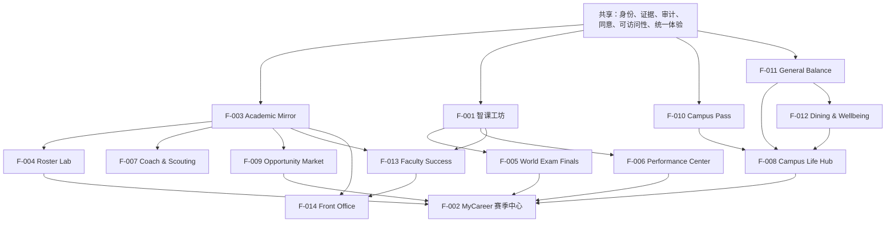

# 模块总览与分工地图

> 本文件是 jiaowu2K26 十四个功能域的全局视图。F-001～F-009 各有独立目录；F-010～F-014 作为长期 University OS 扩展包合并维护，避免愿景阶段产生 15 个散文件。
>
> NBA 2K25 / 历代版本与 maimai DX 的系统级逐项转译、采用/拒绝判断及安全边界详见 [brainstorm/03-2K全功能对标与实现构思](../brainstorm/03-2K全功能对标与实现构思.md)

> **稳定 ID 契约：** F-001～F-014 各功能表中已经发布的编号与含义不得改写、移位或复用。新增交互切片先使用 `P0-*` / `EXP-*` 验收编号，形成独立功能并获批准后再分配未使用的稳定 ID，并同步 Manifest。

## 模块优先级排序

| 排序 | 模块ID | 名称 | 优先级 | 72h 可行性 | 一句话使命 |
|------|--------|------|--------|-----------|-----------|
| 1 | F-001 | 智课工坊 | P0 | 必须 | 来源 → AI 草稿 → 教师审核 → 发布 → 学生互动 |
| 2 | F-002 | MyCareer 赛季中心 | P0 轻 | 必须 | 轻量导航上下文，承载其余模块 |
| 3 | F-005 | World Exam Finals | P1 首选 | 高 | 考试叙事 + Replay，复用 F-001 来源链 |
| 4 | F-004 | Roster Lab | P1 候选 | 中 | Conda 式排课 diff，有辨识度但求解器有风险 |
| 5 | F-009 | Opportunity Market | P1 候选 | 中 | 透明资格匹配，独立性强 |
| 6 | F-003 | Academic Mirror | P1 候选 | 高 | 学术数据只读镜像，P0 可用 fixture 替代 |
| 7 | F-006 | Performance Center | P2 | 低 | 私密进度与能力中心 |
| 8 | F-007 | Coach & Scouting | P2 | 低 | 课程信息与教学风格发现 |
| 9 | F-008 | Campus Life Hub | Vision | 不排 | 校园服务长期枢纽 |
| 10 | F-010 | Campus Pass & Entitlements | P2 / Vision | 不排 | 门禁、实验室、设备与非货币权益的可解释钱包 |
| 11 | F-011 | General Balance & Campus Commerce | P2 / Vision | 不排 | 通用余额、政策资金、支付通道和学生模块预算 |
| 12 | F-012 | Dining & Wellbeing | P2 / Vision | 不排 | 菜单、预算内饮食建议与食堂运营优化 |
| 13 | F-013 | Faculty Success Studio | P2 / Vision | 不排 | 教师教学、科研、合规与晋升证据工作台 |
| 14 | F-014 | Institutional Front Office | P2 / Vision | 不排 | 学校服务、资源、分析与政策 What-if |

## 各模块使命详述

### F-001 智课工坊 / SmartCourse Studio（P0）

把教师有权使用的 PPT、讲义、录音或转写，转成可定位来源、可由教师审核、只在批准后发布的互动学习单元。P0 验收：用一份授权材料完成定位来源 → 生成/构造合同化草稿 → 教师查看来源并修改/通过/移除 → 只发布已通过对象 → 学生完成互动并回看来源。

核心对象链：`Material → SourceFragment → GeneratedObject → ReviewEvent → Publication → LearnerAttempt`

### F-002 MyCareer 赛季中心（P0 轻外壳）

把课程工具放回学生从入学到毕业的连续上下文，让"现在做什么、为什么、下一步去哪"始终可见。P0 只需"当前学期 → 一门课程 → 智课工坊互动 → Box Score"四步。不用单一 OVR 定义学生，不公开 GPA 天梯。

### F-003 Academic Mirror（P1）

在不冒充 SIS/URP/LMS 的前提下，把授权数据转为可追溯、可纠错、可被体验层安全读取的镜像。P0 可用 `demo_fixture`（每条标记 `demo_fixture`，不与生产事实混淆）替代真实镜像。

### F-004 Roster Lab / Semester Environment Resolver（P1/P2）

像 Conda 解析环境一样，把课程规格、已修状态、pins、依赖、冲突和偏好解析成多套可解释、可重现、可比较的学期方案。P1 个人版；P2 机构排课分域。借的是 specs/diff/transaction/lockfile 语义，不直接把 Conda/libsolv 代码硬套到全校排课。

### F-005 World Exam Finals（P1/P2）

把课前准备、阶段检查、期中/期末、复习和证据回放组织成一条有记忆点但不美化焦虑的赛事体验。必须复用 F-001 的来源与审核链，不能另造一套内容系统。亮点：Open-book AI Exam（F005-08）让 AI 逐项回指来源，教师可挑战其证据。

### F-006 Performance Center（P2）

给学生私密、可解释、可行动的进度与负荷反馈，而不是把人压成一个永久 OVR。`Degree Fahrenheit` 可作为短期状态语言实验（不是成绩、不是医学温度）。明确拒绝：公开 GPA/OVR 天梯、永久能力标签、暗示医学诊断。

### F-007 Coach & Scouting（P2）

把课程结构、学习预期、教师公开信息、Office Hours 和组队要求做成中性、可核验的选择支持。不复制 Rate My Professor 式未经验证的情绪排名。

### F-008 Campus Life Hub（Vision）

把散落于网站、公众号、群聊和线下窗口的校园活动、社团、服务与协作入口组织成可搜索、可行动的枢纽。Web/PWA 信息枢纽优先，3D 仅作为后期展会外壳。

### F-009 Opportunity Market（P1/P2）

把期刊、竞赛、科研、实习、奖学金与校园项目做成来源透明、资格可解释、由本人控制资料的机会发现与双向匹配系统。五种 2K 经济机制安全转译：VC → Capacity、Card Pack → 透明机会包、Auction House → 搜索/双方确认、Paid Pass → Entitlement Wallet、Transfer Portal → Pathway Portal。零付费排序、零随机资格、零给人竞价。

### F-010 Campus Pass & Entitlements（P2 / Vision）

统一展示校园卡、移动凭证、访客证、门禁、实验室、设备和餐次/打印页等非货币权益，解释签发方、范围、前置条件、时效与纠错路径。体验层不自行签发权限，不以精细通行轨迹给学生评分。

### F-011 General Balance & Campus Commerce（P2 / Vision）

对用户呈现一个统一余额驾驶舱，但后台严格分离 General Cash、Policy Balance、External Rails、Module Cap 与 Entitlements。支付宝、微信支付、云闪付、银行卡和 Stripe 是支付通道，不读取用户完整外部余额；学生可为学习、餐饮、住宿、交通、科研等模块分配预算和提醒。

### F-012 Dining & Wellbeing（P2 / Vision）

聚合官方菜单、价格、供应、过敏原和营养信息，在时间、地点、预算与自愿偏好约束下给出多套可解释选择；同时以匿名聚合数据帮助学校改进排队、备餐、采购和浪费。它不进行医学诊断，也不建立个人“健康/浪费排名”。

### F-013 Faculty Success Studio（P2 / Vision）

把教师的教学证据、研究方向、资助机会、合规、协作、年度材料与晋升标准组织成 Coach Studio。系统可建议、模拟和整理，但不预测晋升概率，不替代同行评议、伦理审查或人事决定。

### F-014 Institutional Front Office（P2 / Vision）

在权威系统之上提供 Role-aware Portal、服务目录、Case Management、研究生里程碑、排课/空间/餐饮优化、数据仓库和政策 What-if。所有建议都显示假设、来源、受影响群体与权衡，学校责任人保留最终决定。

F-010～F-014 的 80 个稳定功能切片、数据合同与边界统一见 [University OS 扩展包规格](../modules/09-university-os/SPEC.md)。

## 模块依赖关系



关键路径：`共享能力 → F-001 → F-005 → F-002`（P0 + 首选 P1 最短路径）

## 裁剪决策树

```
P0 36h 稳定？
├── 是 → 选一个 P1
│   ├── F-005 World Exam Finals（Demo 效果最好）
│   ├── F-004 Roster Lab（技术辨识度最高）
│   ├── F-009 Opportunity Market（独立性最强）
│   └── F-003 Academic Mirror（与 P0 集成最紧）
└── 否 → 冻结一切 P1 / 硬件 / 视觉，全力修 P0

University OS 扩展包？
├── P0 未稳定 / 无独立 owner / 无授权数据 → 仅保留 Vision 规格
├── P0 稳定且还有唯一支线名额 → 与所有 P1 候选竞争，只选一个 Slice
└── 真实支付、门禁或学校试点 → 不属于黑客松快捷项，必须另走机构与合规批准

团队人数？
├── 4 人 → 全部 P0 + 1 个 P1
├── 3 人 → 全部 P0，P1 选最轻量的（F-003 或 F-005）
├── 2 人 → 仅 P0，砍所有 P1 / 硬件 / 多客户端
```

## 角色-模块分配矩阵

| 模块目录 | 产品/总集成 | 前端/交互 | 后端/证据链 | AI Pipeline/评测 | 视觉/宣发 | 人因研究/体验安全 |
|---------|-------------|-----------|---------------|------------------|-----------|-------------------|
| 00-smartcourse | 主：规格、验收、用户测试 | 主：审核、学习、Replay | 主：状态机、来源、发布门禁 | 主：解析、生成合同、回退与评测 | 辅：Demo 视觉与讲解 | 主：AI/教师权威区分、来源理解、Challenge Call 权力走查 |
| 01-mycareer-shell | 主：导航和跨模块验收 | 主：赛季首页、阵容卡 | 辅：摘要接口 | 辅：不得生成权威状态 | 主：品牌叙事 | 主：非线性生涯、身份标签、叙事强度与关闭测试 |
| 02-academic-mirror | 主：授权与数据边界 | 辅：状态标记 UI | 主：适配器、同步与审计 | 辅：低置信映射进入人工队列 | 辅：来源/冲突状态语义 | 主：数据同意、学校主权、纠错与删除理解 |
| 03-roster-lab | 主：Conda 语义与裁剪 | 主：diff 与方案对比 | 主：约束、求解接口 | 辅：解释生成不得覆盖求解事实 | 辅：技术记忆点 | 主：学生选择权、无解措辞、公平与人工通道 |
| 04-world-exam | 主：赛事节奏与压力友好 | 主：赛前简报、Replay | 主：复用 F-001 链 | 主：Open-book AI Exam 证据回指 | 主：赛事叙事 | 主：考试焦虑、倒计时、失败/重试与普通模式对照 |
| 05-opportunity-market | 主：资格与同意规则 | 辅：机会卡、匹配 UI | 主：四态解释引擎 | 辅：匹配理由与未知项 | 辅：透明机会表达 | 主：资格公平、最小披露、匹配偏差与反操纵 |
| 06-performance-center | 主：指标与反伤害测试 | 辅：面板、徽章、可访问性 | 辅：聚合与分享授权 | 辅：建议来源和置信 | 主：状态/气候视觉 | 主：Degree Fahrenheit、OVR、徽章、压力、分享与撤回 |
| 07-coach-scouting | 主：来源、公平与治理 | 辅：课程 Profile | 辅：版本、聚合、举报 | 辅：不得生成教师人格结论 | 辅：中性 Scouting 语言 | 主：教师声誉、群体偏差、学生举报与教师纠错权 |
| 08-campus-life | 愿景阶段 | 愿景阶段 | 愿景阶段 | 愿景阶段 | 主：统一社区体验 | 主：组队排斥、导师权力、骚扰、退出和通知压力 |
| 09-university-os（F-010～F-014） | 主：选 Slice、权威边界、风险和停损 | 主：同一 Role Lens 与组件体系 | 主：身份/权限/账务/策略适配边界 | 辅：建议解释，禁止自动权威决定 | 主：统一世界美术 | 主：门禁监控、支付强迫、健康/人事敏感数据与机构权力 |

> 这是能力分配，不是人数表。团队 2–4 人时允许一人兼岗，但每条 P0 责任链只能有一个最终 owner。AI 可辅助组件、接口、测试和文档；主责人必须理解、审核并能修改产出。

## 招募任务卡

招募时不要把十四个模块同时分给新队友。先交付一张任务卡，内容固定为：唯一目标、输入、输出、6h 检查点、36h Done、明确不做和回退。

- **前端/交互：** 交付赛季入口、教师审核、学生互动和 Replay；必须覆盖正常、空、失败、离线与减少动效。
- **后端/证据链：** 交付来源对象、审核状态机、发布门禁、审计和数据库适配；模型绝不能直接发布。
- **AI Pipeline/评测：** 交付材料解析、来源约束草稿、Schema 校验、错误分类和 fixture 回退；输出必须带 `source_ids`。
- **产品/总集成：** 交付范围冻结、Claim Ledger、切片验收与 90 秒 Demo；对外说法不得超过现场证据。
- **视觉/宣发：** 交付统一游戏世界、组件视觉、招募与海报；不复制 2K/舞萌资产或具体布局。
- **人因研究/体验安全：** 通过 [Human Factors Scouting Room](HUMAN-FACTORS.md#7-human-factors-scouting-room-工作流) 交付文化语义、首读理解、压力、公平、隐私、社群和可访问性证据。

## 四人单功能 WIP 协议

> **WIP 上限：1 个产品切片。** “一个功能做完再做下一个”不等于四人排队等待，而是四个能力岗围绕同一个验收目标并行；没有跨过 Accepted 门禁，下一切片不得进入开发。

### 每个切片的固定工作包

| 能力岗 | 同一切片内的交付 |
|---|---|
| 产品 / 总集成 | 建唯一 Issue、冻结验收口径与明确不做；准备授权输入；在最终演示机验收并负责合并、Tag 与 STATUS 更新 |
| 前端 / 交互 | 只实现该切片所需界面；覆盖正常、空、加载、失败、fixture 与减少动效状态 |
| 后端 / 证据链 | 领域对象、API、状态迁移、持久化、审计与错误合同；数据库更改只走 migration |
| AI Pipeline / 评测 | 输入/输出 Schema、解析或生成适配器、`source_ids`、fixture、失败分类与最小评测 |
| 人因研究 / 体验安全 | 为该切片写首读含义、压力/公平/隐私假设，走查失败、退出、申诉与可访问路径；记录反例和停损建议 |

> 这里列的是五类交付，不要求五个人。四人团队可以由设计同学主责人因、产品复核，但不得省略这一工作包。

### P0 实现顺序

| 顺序 | 验收 ID | 本轮唯一目标 | 对应规格 |
|---:|---|---|---|
| 0 | P0-00 | Gate-1 纵向技术基线：Web → API → 持久化 → 一个 source record → 一次审核状态迁移；用于冻结技术栈，不算产品扩展 | GATE-1；F001-01/02/08 的最小技术证明 |
| 1 | P0-01 | 授权材料登记、解析状态与可定位来源片段 | F001-01～03 |
| 2 | P0-02 | 带 `source_ids` 的结构化草稿、Schema 校验与明确标注的 fixture 回退 | F001-04～06、F001-15 |
| 3 | P0-03 | 教师同屏查看来源并执行编辑、通过、移除；ReviewEvent 只追加 | F001-07～08 |
| 4 | P0-04 | 只有 approved 且来源有效的具体版本能形成不可变发布版本 | F001-10 |
| 5 | P0-05 | 学生完成至少一次互动并查看教师批准的解析与来源 | F001-11 |
| 6 | P0-06 | Replay / Box Score 回放来源、人工修改、发布版本和本人互动 | F001-13；EXP-CASE-02 |
| 7 | P0-07 | MyCareer 轻外壳串起赛季首页 → 课程阵容 → 学习 → Replay | F002-03/04；P0-JUMP-01/02 |

### Accepted 门禁

每个切片必须同时满足以下条件，才能打 annotated Tag `p0-xx-accepted` 并打开下一张主 Issue：

1. 验收条件、输入/输出 Schema 与明确不做没有漂移；若变更，先由产品负责人记录决定。
2. 格式化、静态检查、单元/契约测试和构建全部通过；正常与至少一个失败/回退路径可复现。
3. 在最终演示机从干净环境走通；另一名非作者队友完成 Review，作者不能给自己批准。
4. PR 附运行证据、测试命令、截图/日志、风险和回退；总集成人员 squash 合并到可演示的 `main`。
5. 对应模块 `STATUS.md` 与 Claim Ledger 已更新；未实现内容仍标记 pending。

紧急修复已验收切片可用 `fix/p0-xx-*` 插队，但不得借修复名义加入新功能。36 小时前完成全部 P0；只有 P0 稳定后，团队共同选择且只选择一个 P1。

## 共享能力（跨模块，实现一次）

| ID | 共享能力 | 最低要求 | P0 是否必须 |
|----|---------|---------|------------|
| X-01 | 身份与角色 | 学生、教师、导师、管理员最小权限分离；测试身份显式标记 | 是（最小集） |
| X-02 | 来源与证据 | 每条外部事实保存来源、定位、版本、时间、权威等级和可用权利 | **是** |
| X-03 | 事件与审计 | 重要动作追加记录；包含操作者、前后状态、原因和时间 | **是** |
| X-04 | 版本与纠错 | 支持修订、撤回、过期、申诉和对旧结果的影响说明 | P1 |
| X-05 | 同意与隐私 | 默认最小采集、最小披露；可查看、导出、撤回和删除 | P1 |
| X-06 | 搜索与筛选 | 结果可解释；筛选条件可清空；不默认使用敏感属性 | P1 |
| X-07 | 通知 | 显示来源和可操作下一步；可静音、汇总、设免打扰 | P2 |
| X-08 | 可访问性 | 键盘、读屏、对比度、字幕、减少动效、非颜色状态表达 | **是** |
| X-09 | 离线与降级 | 明确"实时/缓存/演示样例/不可用"，不伪装实时成功 | **是** |
| X-10 | 可解释推荐 | 给出匹配原因、冲突、未知项、置信依据和替代方案 | P1 |
| X-11 | 个人数据可携带 | 提供人类可读的非权威归档，以及带签名、可选加密、可校验并可进入受控导入流程的可信归档；二者均含 Schema、来源和版本 | P0 契约 / P2 完整 |
| X-12 | 运行证据 | 输入版本、模型/规则版本、输出、延迟、错误与回退可复查 | P1 |
| X-13 | 统一游戏体验 | 全局壳、Token、组件、图标、动效、声音和任务循环只维护一套；模块不得独立换肤 | **是** |
| X-14 | 策略与权益 | 角色、范围、前置条件、期限、同意、例外和权威来源可解释 | P2 |
| X-15 | 分账与预算 | General Cash、Policy Balance、External Rails、Module Cap、Entitlement 语义分离 | P2 |
| X-16 | Controller-first 多输入 | 手柄、键盘、触控与读屏共享语义动作；确定性焦点、动态键帽、校准/重映射、断连回退和高风险二次确认 | **P0 演示主路径** |

## 本地黑客松与成品案例归并（实验验收 ID）

2026-07-22 对“下载/已经整理”中的其他黑客松、成品项目、竞赛复盘、NBA 2K 与 maimai 机制进行了定向审计。结论不扩张 F-001～F-014，也不改变 214 个稳定切片；新增内容使用 EXP-CASE-* 作为跨模块验收与研究编号。除 EXP-CASE-01/02 的 P0 最小合同外，其余均不能绕过“P0 稳定后最多选择一个支线”的裁剪规则。

| 实验 ID | 可迁移能力 | 归并到现有模块 / 共享能力 | 最小验收 | 阶段 |
|---|---|---|---|---|
| EXP-CASE-01 | Human Override Protocol | X-02/03/04/09；F-001/003/004/013/014 | AI/规则结果显示来源、证据状态、未知、可编辑草稿和回退；人或确定性策略批准后才发布/执行 | **P0 最小合同** |
| EXP-CASE-02 | Academic Replay & Evidence Pack | X-03/12；F-001/002/005/013/014 | 关键事件具备稳定 ID、操作者、前后状态、理由、来源、版本、时间和纠错/申诉入口，可从结果回放 | P0 最小 / P1 完整 |
| EXP-CASE-03 | Research Quest Tree | F-009、F-013 | 科研目标可拆成假设、任务、实验、资源、证据、结果和 Next Move；阻塞与依赖可见 | P2 / Vision |
| EXP-CASE-04 | Scenario Draft Board | F-002/004/009 | 选课、转专业、科研或机会至少有 A/B/C 三案；显示约束、取舍、迁移成本、未知和回滚点 | P1 |
| EXP-CASE-05 | Season Highlight Reel | F-002/005/006 | 生成本人私密、可编辑的赛季高光、时间胶囊和“一年前的今天”；不得变成公开成绩榜 | P1 |
| EXP-CASE-06 | Mastery Gates & Builder Mode | F-001/005/006/008/009 | 按先修与真实证据解锁学习/创作阶段；学生内容须有来源和审核；排名默认私密或自愿加入 | P1/P2 |
| EXP-CASE-07 | Institutional Transaction State Machine | X-03/04/14/15；F-010/011/014 | 高风险事务使用 Draft → Pending → Reviewed → Approved → Executed → Reconciled，并覆盖 Rejected/Expired/Fault/Appeal | P2 / Vision |
| EXP-CASE-08 | Campus Footprints | F-008/010/012 | 用户主动选择记录活动、地点、饮食或服务反思；按用途授权、可删除，不从通行轨迹秘密推断画像 | Vision |
| EXP-CASE-09 | Builder & Test Court | F-002/004/006/009 | 目标与约束生成 A/B/C 方案，在沙盒中预演并显示依赖、冲突、未知和相对当前方案的 diff；不写回权威系统 | P1/P2 |
| EXP-CASE-10 | Learning Rhythm & Buddy Chart | F-001/005/006/007/008 | 同一目标至少两种支架，输入即时回指证据；支持低压力练习和真正互补的双人任务，键盘/触屏/读屏信息等价 | P1/P2 |
| EXP-CASE-11 | Season Spotlight & Mentorship | F-002/005/006/007/008/009/013 | 可选学期高光周包含技能挑战、导师、共同目标、作品展示与多元贡献奖；不按 GPA 选秀、不做人气总榜 | P2 / Vision |

### 归并纪律

1. EXP 是可验证的切片或设计合同，不是新的顶层模块，也不进入“已完成”声称。
2. 一个能力能由既有 F 切片表达时，只补充验收口径，不改稳定 ID 的含义和编号。
3. Human Override、Evidence Pack 和机构状态机共用一套领域事件，不在每个模块复制实现。
4. Builder/Test Court、Learning Rhythm、Spotlight、Highlight Reel、Campus Footprints 和公开/同伴比较默认不进入 P0。
5. 游戏机制须通过“Vought Test”：不能用于秘密画像、公开羞辱、付费资格、随机机会或权威冒充；无法改造则拒绝。
6. 资料来源、读深度、采纳/拒绝理由见 reference/RESEARCH.md 与 `brainstorm/03-2K全功能对标与实现构思.md`；对外引用前重新核验原始来源与许可证。

## 模块目录与物理映射

```
modules/
├── 00-smartcourse/        ← F-001
├── 01-mycareer-shell/     ← F-002
├── 02-academic-mirror/    ← F-003
├── 03-roster-lab/         ← F-004
├── 04-world-exam/         ← F-005
├── 05-opportunity-market/ ← F-009
├── 06-performance-center/ ← F-006
├── 07-coach-scouting/     ← F-007
├── 08-campus-life/        ← F-008
└── 09-university-os/      ← F-010～F-014（合并式长期扩展包）
```

## Definition of Done（全局）

任何功能只有同时满足以下条件，才可在路演中称为"完成"：

1. AdventureX 正式开赛后实现并有代码提交
2. 真实可操作，不只是概念图或视频
3. 有正常、空、失败和回退状态
4. 输入、输出、来源、测试和版本可复查
5. 权限、隐私、许可证和第三方归属已核对
6. 对外说法不超过现场证据
7. 团队成员能解释并修改自己负责的实现
8. 页面复用全局壳、Token、组件、图标与动效，通过“零模块私有换肤”检查
9. 涉及支付、门禁、健康、人事或学校治理时，权威边界、申诉、人工回退与数据保留已验证
10. 通过对应人因检查：首读无权威冒充或身份伤害，失败/退出/举报/申诉可达，研究证据记录反例与样本局限
