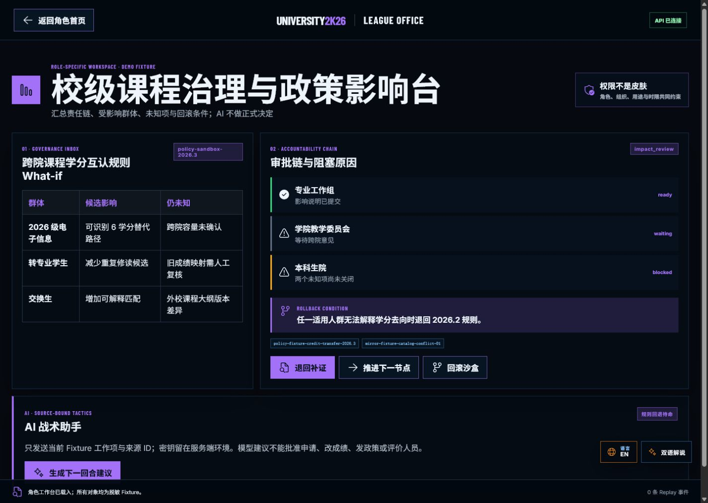
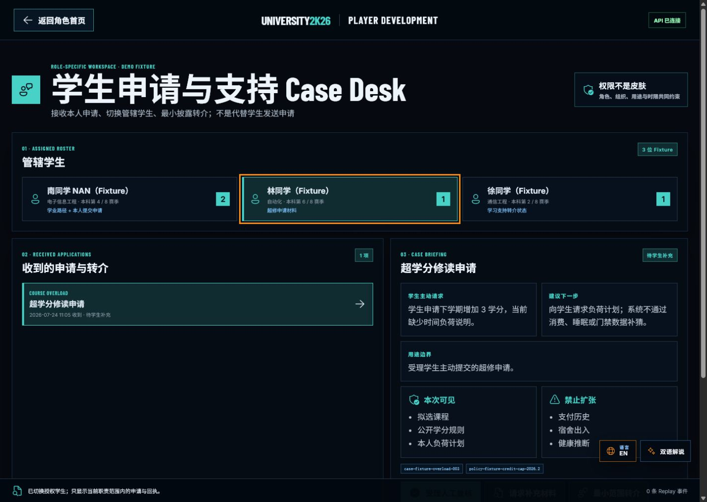
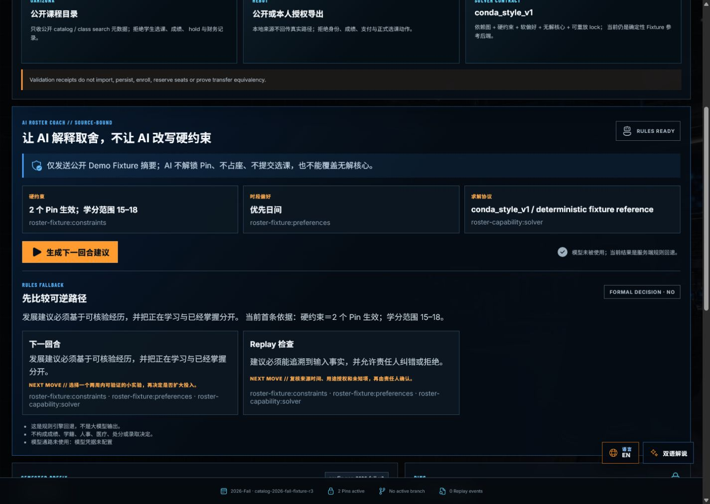
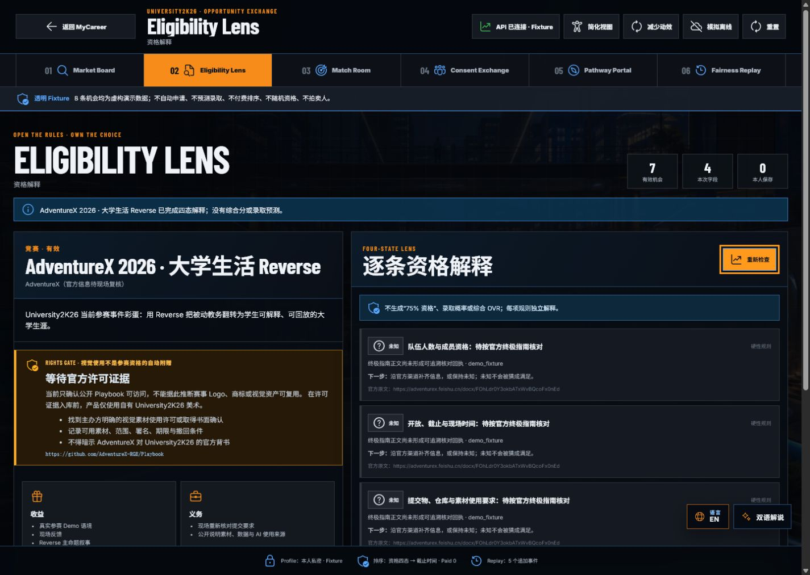
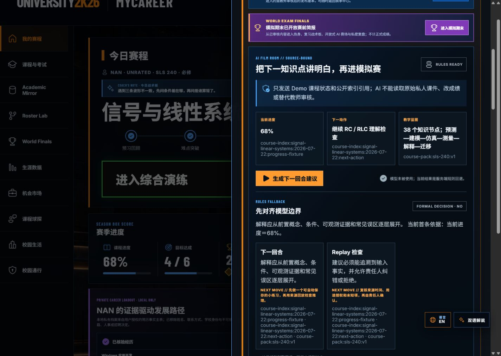
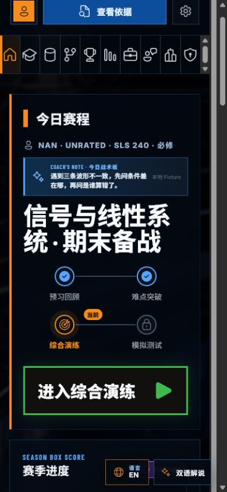
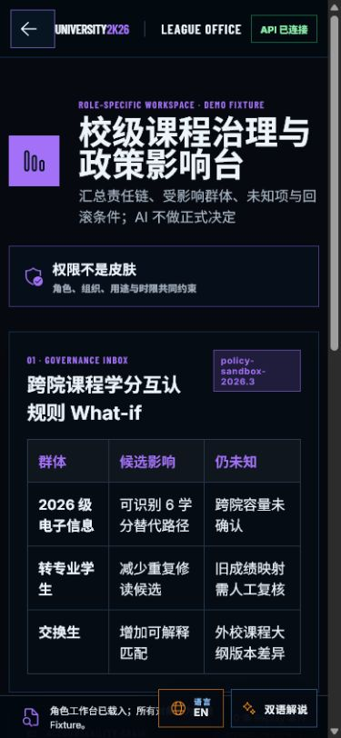
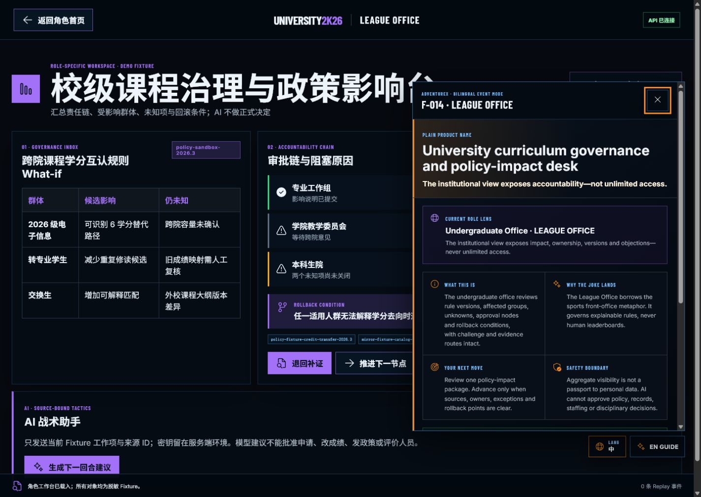
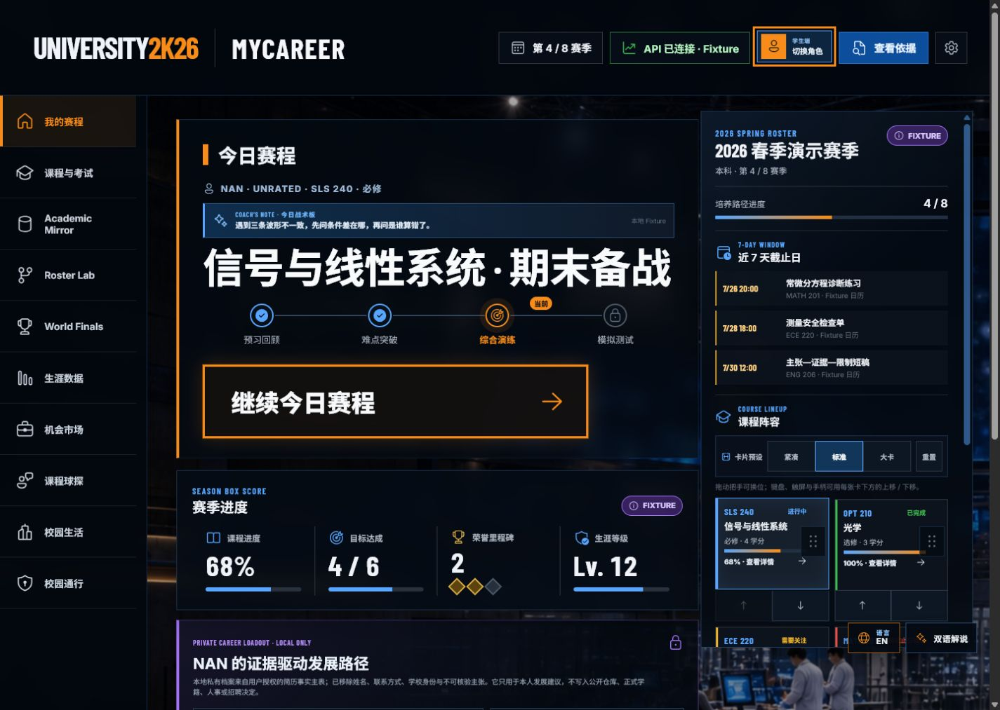

# University2K26 V0.9 · 角色、AI、课程与机会链路验收

> 日期：2026-07-24
> 表面：本机正式 Web/PWA，`http://127.0.0.1:4173/`
> 浏览器：Codex 内置 Edge/Chromium 表面
> 范围：学生首页、四个机构角色工作台、来源约束 AI、SLS 课程蓝图、Roster Lab、AdventureX、History Back、390×844 重排与英文角色导览
> 结论：**当前 Chromium 技术验收通过；仍不是跨浏览器、实体设备、完整双语或正式学校授权验收。**

## 用户目标与可访问性目标

用户应能在同一游戏世界中切换学生、教师、辅导员、专业负责人和本科生院角色，并立即理解“我现在负责什么、能看什么、不能决定什么”。键盘、鼠标、触控和手柄应共享语义动作；移动端不得产生页面级横向滚动；游戏化文案不得制造排名、羞辱、伪确定性或 AI 正式决定。

## 验收步骤

### 1. 本科生院政策影响台 — 健康

- 受影响群体、审批链、未知项、来源 ID 与回滚条件在同一屏可见。
- AI 明确是来源约束建议，不能批准政策。
- 风险：正式生产仍需 SSO、组织范围、用途和时限的服务端授权。

### 2. 辅导员 Case Desk — 健康

- 可在管辖学生之间切换，并接收无障碍、超修等学生申请。
- 交互语义是“接收、复核、转介和跟进”，不是代替学生发起申请。
- 风险：当前均为脱敏 Fixture，未验证真实学校工单、紧急转介或屏幕阅读器路径。

### 3. Roster Lab 与 AI 回退 — 健康

- `conda_style_v1` 生成三个可解释候选方案；导入门明确只校验公开目录元数据，不选课、不持久化。
- 未配置模型时显示 Rules Fallback，并保留来源 ID，不伪装成实时模型。
- 风险：真实 UArizona/HEBUT 数据许可、目录导入和 SAT/libsolv 级生产求解器未完成。

### 4. AdventureX 搜索与 Rights Gate — 健康

- 搜索可稳定定位 AdventureX；资格结论保持三个“未知”，未复用无关示例规则。
- 视觉使用权状态明确为等待官方确认，不暗示主办方背书。
- 风险：官方资格、提交要求和视觉授权仍须保存可追溯确认记录后才能升级状态。

### 5. SLS 240 完整课程蓝图 — 健康

- 显示 6/6 来源、65/65 可视页、5 单元、10 课次与 38 个有边界的知识节点。
- 课程解释能走同一来源约束 AI/规则回退合同。
- 风险：这是已审核本地材料的 Demo 教学重组，不代表教师正式发布或学习成效验证。

### 6. 390×844 学生首页 — 健康

- 主要行动、赛季状态和课程阵容在窄屏重排后仍可达。
- 没有页面级横向溢出。
- 风险：截图只能证明重排外观，不能代替真实触屏目标尺寸、缩放、读屏和性能测试。

### 7. 390×844 机构工作台 — 修复后健康

- 影响表从桌面表格改为三列可换行布局，页面宽度回到视口范围内。
- 风险：极长德语、俄语等高膨胀文本仍需伪本地化与真实语言回归。

### 8. 英文 League Office 导览 — 健康

- 机构角色不再误用 MyCareer 文案；`LEAGUE OFFICE`、职责、边界和下一步都能被英文读者直接理解。
- 风险：目前是核心赛事导览与角色解释双语，不是所有深层页面的完整英文翻译。

### 9. 中文学生首页最终交付态 — 健康

- 最终保留在学生 MyCareer 首页；首页层级、赛季上下文、主行动、课程阵容和 Fixture 边界清楚。
- 桌面视口没有页面级横向溢出，中文未见明显挤压或截断。
- 视觉风险：信息密度仍高，后续动效与声音工作应优先强化“选择 → 结果 → Replay → Next Move”，不能用持续闪烁增加刺激。

## 综合判断

### 已确认的优势

1. 五角色不是换皮：主任务、数据边界、责任链和工作台对象确实不同。
2. 游戏感来自赛季、回合、战术板、Box Score 与 Replay 的一致语义，不依赖复制 NBA 资产。
3. AI、求解器和机会匹配都能显示来源、未知与回退，不把建议包装成权威决定。
4. 学生与机构窄屏均没有页面级横向溢出；中文主屏和英文角色导览保持同一美术系统。

### 仍需验证

1. Firefox、macOS/iOS Safari 与真实 Android/HarmonyOS 浏览器运行时。
2. 实体手柄方向键/摇杆、真实触屏、屏幕阅读器、200% 缩放和 Reduced Motion 实机路径。
3. 英文深层页面、俄语等高变形语言的伪本地化、母语者润色与术语一致性。
4. 真实学校授权、持久化、Moonshot/GX10 模型、UArizona/HEBUT 数据与正式求解器。

截图只能支撑以上可见状态与实际回放过的交互，不能据此宣称完整 WCAG 合规、跨浏览器兼容或正式学校系统已经完成。
