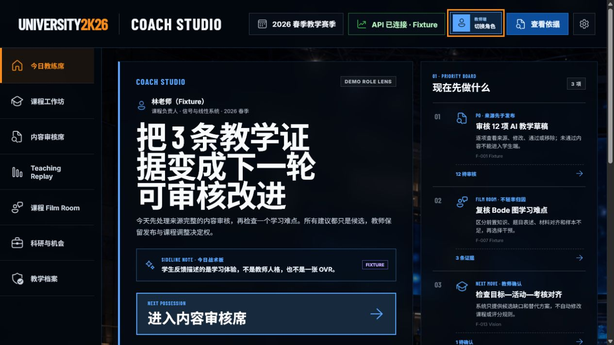
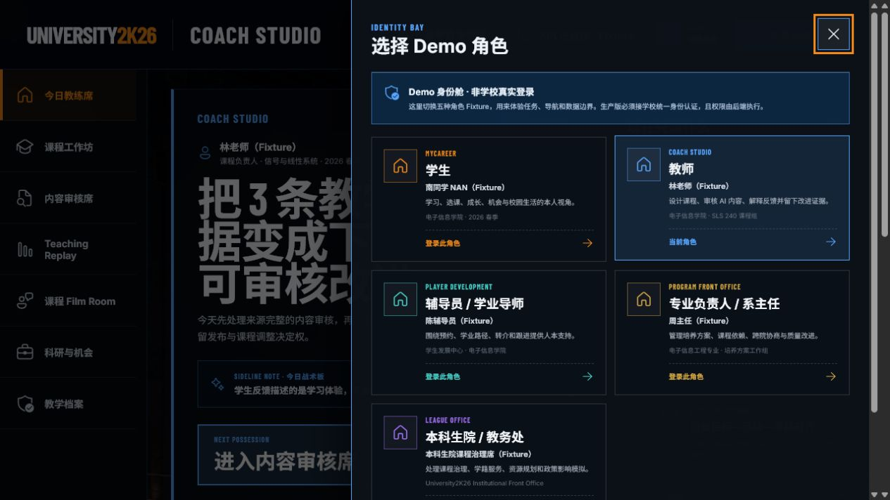
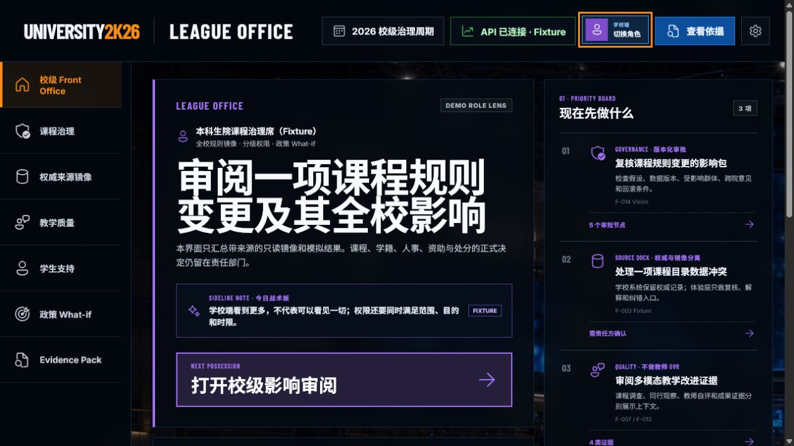

# University2K26 五角色 Role Lens 体验审计

> 审计日期：2026-07-24
> 审计范围：首页角色入口 → 五角色选择 → 教师与本科生院任务首页
> 审计模式：UX + 可见无障碍风险联合审计
> 浏览器：Codex 内置 Edge / Chromium 会话，连接本地 Vite Preview
> 数据边界：全部为脱敏 `Fixture`；本审计不代表学校 SSO、真实权限或生产集成已经完成

## 1. 用户目标与可访问性目标

用户应能从任何首页明确发现角色入口，理解当前身份，切换到学生、教师、辅导员 / 学业导师、专业负责人 / 系主任或本科生院 / 教务处，并在切换后立即看到与职责匹配的任务、导航和数据边界。

可访问性目标是：角色切换不只依靠颜色表达；按钮具有可读名称与当前状态；对话框有标题、关闭动作和焦点；主要行动与权限边界能够被键盘和辅助技术识别。

## 2. 审计步骤

### Step 1 · 教师角色首页——健康

- 优点：顶部同时显示 `COACH STUDIO`、教师端角色、赛季和 Fixture 状态；主任务“进入内容审核席”足够明确。
- 优点：Priority Board、Role Box Score、责任链和数据边界形成从“现在做什么”到“为什么能做”的完整层级。
- 优点：明确写出“工作状态，不是人员评分”，并将公开教师排名固定为 0，避免把游戏化误用成人事 OVR。
- 风险：桌面首屏信息密度较高；低熟练用户可能先阅读右侧三项任务而忽略主行动。
- 建议：保持当前主行动的最高视觉权重；路演时不要再向首屏加入新卡片。

### Step 2 · 五角色选择器——健康，仍需实机键盘/读屏复核

- 优点：入口位于顶栏高频区域；对话框首先说明“非学校真实登录”，真实身份与 Demo 切换没有混淆。
- 优点：每张角色卡同时提供游戏模式、正式角色、Fixture 人物、职责摘要和组织范围；当前角色还使用文字与 `aria-pressed`，不只依靠颜色。
- 优点：五个角色沿用同一视觉语言，没有把学校端退回普通后台管理界面。
- 风险：在当前桌面高度下，第五张卡片需要滚动才能看到完整说明；首次打开时焦点位于关闭按钮，是否应该先落在当前角色卡仍需真人键盘测试。
- 建议：保留对话框滚动；后续真人测试比较“关闭按钮先获得焦点”和“当前角色先获得焦点”哪种更不易迷失。

### Step 3 · 本科生院角色首页——健康

- 优点：角色切换后品牌、周期、导航、主任务、指标和紫色强调色同步变化，角色差异明确但系统仍是同一个产品。
- 优点：学校端主动写出“看到更多，不代表可以看见一切”，并列出无目的个人明细、学生私密反思、隐藏教师排名和 AI 自动正式决定等禁止范围。
- 优点：F-014 内容明确标为 `Vision`，未把政策 What-if 或正式审批伪装为已实现能力。
- 风险：`Front Office`、`Evidence Pack`、`What-if` 等中英混合词对校内非技术人员可能有学习成本。
- 建议：传统叙事模式下继续替换为“校级工作台 / 证据包 / 政策影响模拟”等正式称呼，同时保留沉浸模式的游戏表达。

## 3. 最高优先级结论

1. 五角色的入口、职责差异、任务首页和数据边界已经构成可演示的完整 Role Lens。
2. 当前最需要的不是继续增加第六个角色，而是真人完成键盘-only、物理手柄、触屏和读屏器复核。
3. 生产版必须将角色来源从 `localStorage` Fixture 换成学校 SSO，并由服务端执行角色、组织范围、用途和时限授权；前端角色值不能成为安全边界。
4. 教师、辅导员和学校管理端都应继续显示“候选建议、来源、版本、Replay 与人工决定”，避免游戏化演变为隐藏排名或自动处分。

## 4. 证据限制

- 截图只能证明可见层级和当前浏览器中的结构，不能证明完整 WCAG 合规。
- 本轮没有使用真实学校身份、真实师生数据、正式审批、真实支付或门禁。
- Firefox、macOS / iOS Safari、物理手柄、真实触屏、缩放 200%、Windows Narrator 与第二台机器仍待验证。
- 角色的组织关系、委托、撤权和离职失效没有生产实现；当前只是前端 Fixture 体验假设。
