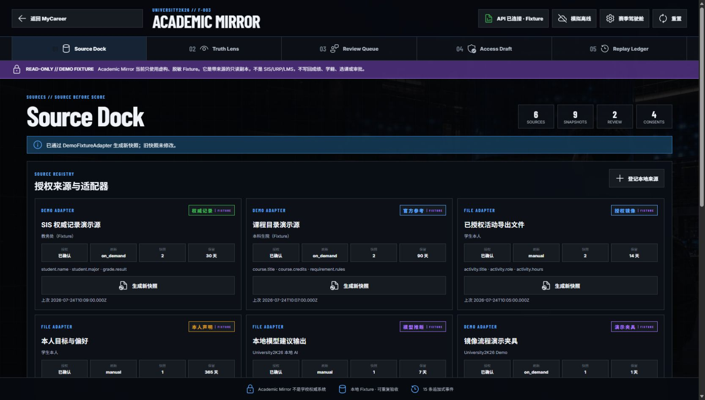
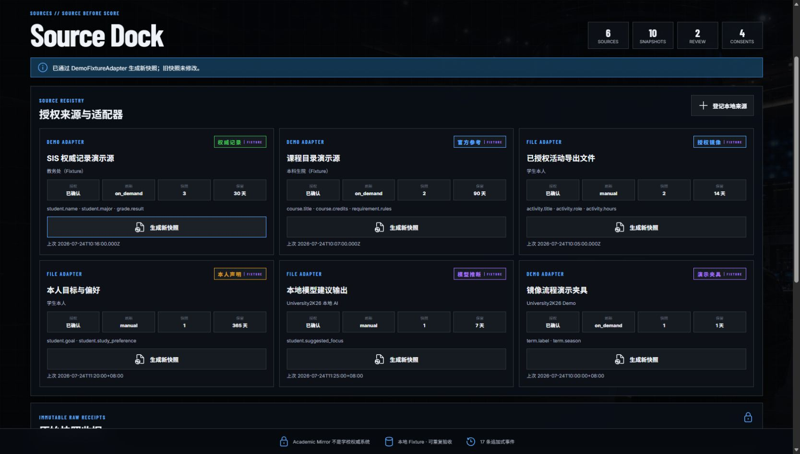
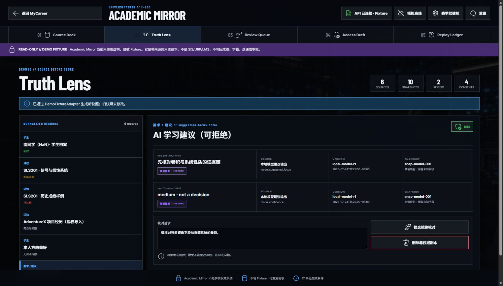
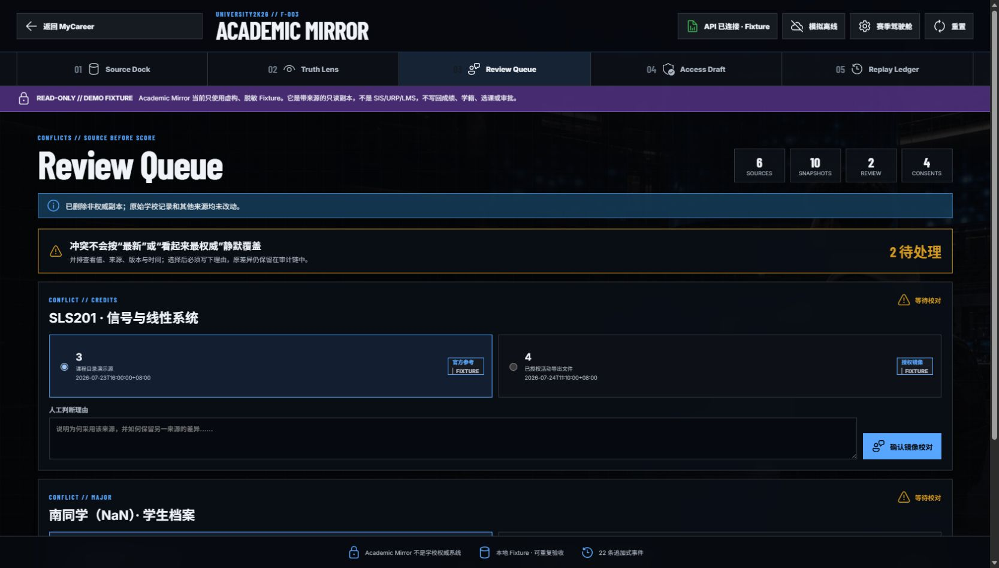
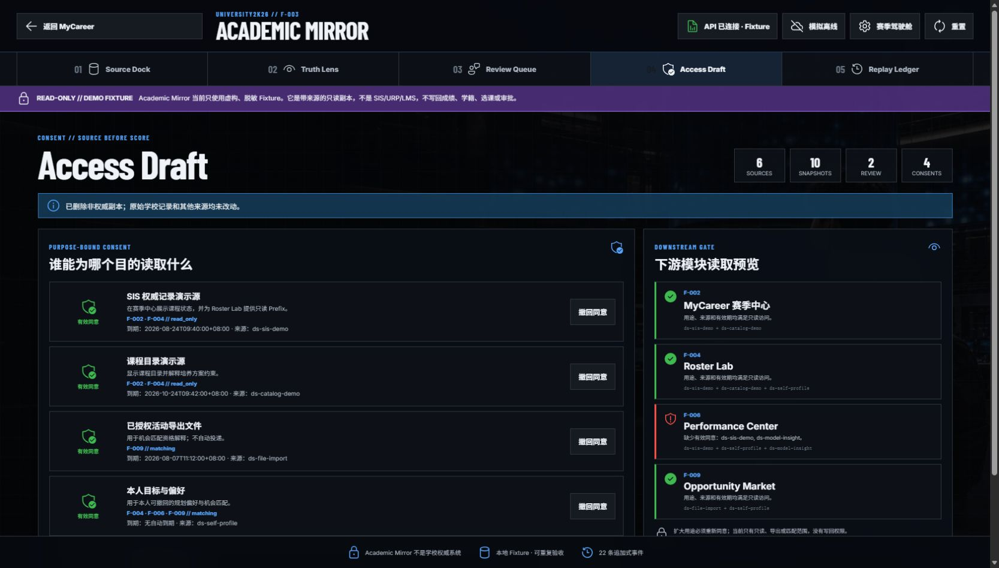
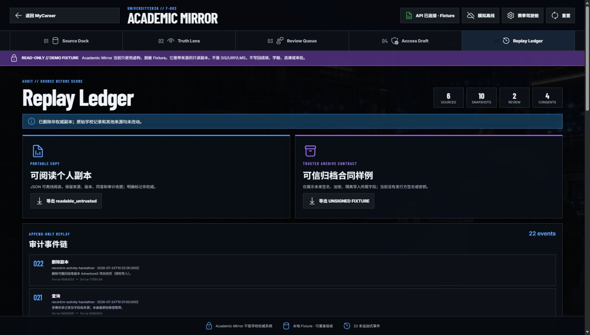

# Academic Mirror / Source Dock 交互审计

> 日期：2026-07-24
> 范围：University2K26 V0.9 的 F-003 Academic Mirror 五步流程
> 浏览器：Microsoft Edge（Chromium）
> 结论：领域能力成立，但当前入口、命名和反馈把基础设施工作台误包装成了学生主任务。

## 它实际负责什么

Academic Mirror 是 University2K26 的“带来源只读数据镜像层”：

1. 从 SIS / URP / LMS / 本地授权文件或 Fixture 登记数据来源；
2. 保存不可变快照、版本、哈希和字段级来源；
3. 将不同来源映射成统一课程、成绩、档案等记录；
4. 对冲突值进行人工校对并保存理由；
5. 控制哪些模块能为哪个目的读取哪些来源；
6. 导出个人可读副本和未来可信归档的合同样例；
7. 保留追加式审计事件，但不写回学校权威系统。

它对架构很重要，却不是学生每天主动操作的“游戏关卡”。完整控制台更适合放在“设置 → 数据与隐私”或学校/管理员视图；学生主线只应看到简化的数据状态和待办。

## 审计流程

### 1. Source Dock — 有动作，但结果几乎不可见

点击首个“生成新快照”后，系统真实发生了：

- 总快照数由 9 增加到 10；
- SIS 来源的快照数由 2 增加到 3；
- “上次同步”时间更新；
- 新增一份原始快照收据；
- 审计事件由 15 增加到 17。

问题是这些变化分散在页面四处，且多数位于折叠线以下。按钮没有加载、完成动效、结果卡、差异摘要或明确下一步，所以用户会合理地判断“没反应”。

更严重的是，当前 Fixture 即使内容哈希没有变化也会追加一份相同快照。更合理的规则是：

- 按钮改为“检查更新”；
- 内容未变化时显示“没有新数据，继续使用上一版本”，只记同步审计事件；
- 内容变化时才生成快照，并弹出结果收据：
  `新增 1 份快照 · 3 个字段 · 0 个冲突 · 打开 Truth Lens`。

### 2. Truth Lens — 能解释来源，但像数据库调试器

优点：

- 可以逐条查看学生、课程、成绩、活动、本人偏好和模型建议；
- 每个字段都有来源、版本、快照与转换规则；
- 清楚区分权威记录、授权镜像、本人声明、模型推断和 Fixture。

问题：

- 默认选中“AI 学习建议”，没有先回答学生最关心的“我的课程/成绩从哪里来”；
- `normalized records`、`sourceVersion`、`rawSnapshotId` 等内部术语过重；
- 每次选择记录都会新增“查询”审计事件，导致计数快速上涨，却没有向用户解释为何普通浏览也被记录；
- “删除非权威副本”与“提交镜像校对”并排，且没有确认、预览或撤销。

### 3. Review Queue — 价值明确，但缺少任务完成感

这是五步中最容易理解的一步：把两个冲突值并排展示，要求选择来源并填写理由。

需要补充：

- 明确写出冲突会影响什么，例如“将影响 Roster Lab 的学分上限计算”；
- 完成后出现挑战判罚式结果动画和“剩余 1/2”；
- 文本框应在填写前解释“为什么必须写理由”；
- 当来源无法由学生裁决时，应提供“提交学校核验”，而不是让学生强行选择。

### 4. Access Draft — 重要，但应该属于数据与隐私中心

它展示用途绑定同意，以及 MyCareer、Roster Lab、Performance Center、Opportunity Market 的读取门禁。这对“学生掌握自己数据”非常有价值。

问题：

- “Access Draft”像内部权限模型，不像学生能理解的任务；
- `F-002`、`ds-sis-demo`、`read_only` 等开发标识占据主视觉；
- 撤回同意会影响哪些可见功能，应在操作前用自然语言预览；
- 当前开关没有二次确认或短时撤销。

推荐名称：`Data Permissions · 数据授权战术板`。

### 5. Replay Ledger — 适合审计，不适合默认展示

导出个人副本、展示事件链是合规与数据主权亮点，但哈希、事件号和合同样例更适合高级页面。学生主界面只需要：

- 最近更新；
- 最近授权变化；
- 可撤销操作；
- “下载我的数据”；
- “查看完整审计记录”高级入口。

## 最高优先级问题

1. **角色错位：** 把后台数据治理工作台放进学生主导航，用户不知道为什么要来这里。
2. **反馈不足：** 核心按钮只改变小数字和折叠线以下的收据，没有结果卡和下一步。
3. **重复快照：** 输入哈希不变仍生成新快照，制造“操作成功但数据没变”的噪声。
4. **危险操作过轻：** 删除副本、撤回同意、重置均缺少确认/撤销和影响预览。
5. **全局消息串台：** 上一步的状态消息会留在其他步骤，使当前页面出现与任务无关的提示。
6. **模式按钮含义反向：** “赛季驾驶舱/传统数据视图”展示的是当前状态却长得像切换动作，且两种视图只换文案和字形，价值不清。
7. **缺少游戏闭环：** 没有任务目标、完成度、奖励/解锁、挑战结果或清晰的下一关。

## 推荐产品结构

### 学生主线：Data Passport / 我的数据护照

- 已连接来源：3
- 数据新鲜度：2 正常 / 1 待更新
- 待本人处理：1 个冲突
- 当前授权：4
- 主按钮：`完成本周数据体检`
- 次级入口：`查看数据来源`、`管理授权`、`下载我的数据`

### 高级入口：Academic Mirror Console

保留现有五步能力，供高级用户、学校管理员和演示时讲解架构使用。

游戏化语义可以改为：

- Source Dock → `Data Locker · 数据更衣室`
- Truth Lens → `Film Room · 证据回放`
- Review Queue → `Challenge Center · 挑战判罚`
- Access Draft → `Permission Playbook · 授权战术板`
- Replay Ledger → `Season Archive · 赛季档案`

严肃的来源、同意和审计语义仍保留在副标题和详情中。

## 可访问性风险与证据边界

- 当前按钮和表单具备可识别语义，页面也提供跳到主要内容的链接，这是明确优点。
- 截图不能证明完整键盘顺序、读屏播报、缩放到 200% 或真实触屏体验。
- 状态更新虽然使用 `aria-live`，但视觉反馈不够集中；读屏用户也可能只听到抽象的“生成新快照”，不知道变化落在哪里。
- 危险操作应增加确认对话框、焦点管理和可撤销反馈。
- 审计中使用的是本地 Fixture；测试后已执行重置，没有保留本轮生成、查询或删除事件。

## 建议处理顺序

1. 先补“检查更新 → 结果收据 → 打开 Truth Lens”的闭环；
2. 将学生入口简化为 Data Passport，高级控制台保留现有能力；
3. 为删除、撤回和重置补确认、影响预览和撤销；
4. 将状态消息改为当前动作的临时收据，不跨步骤长期残留；
5. 最后再增加动画、音效和赛季化命名。
