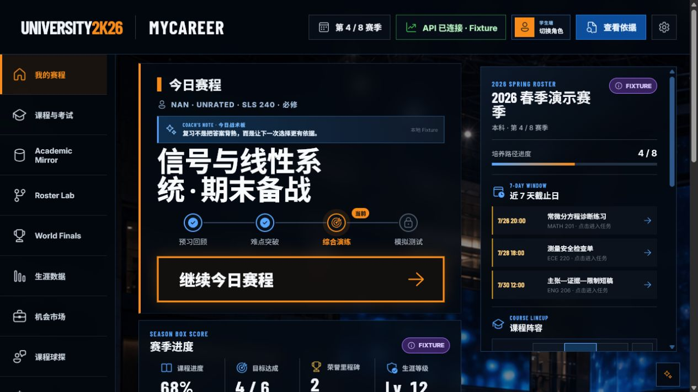
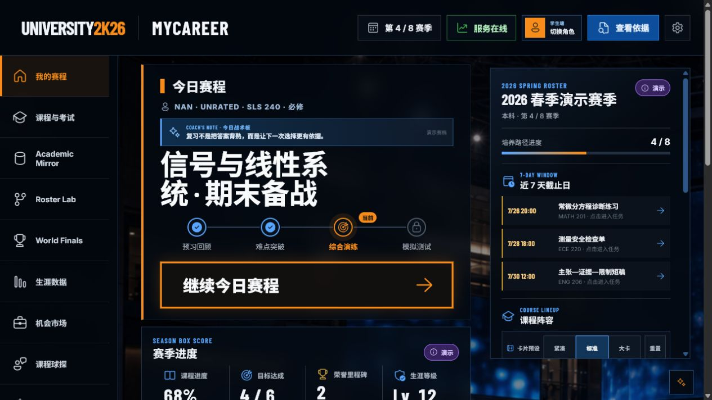
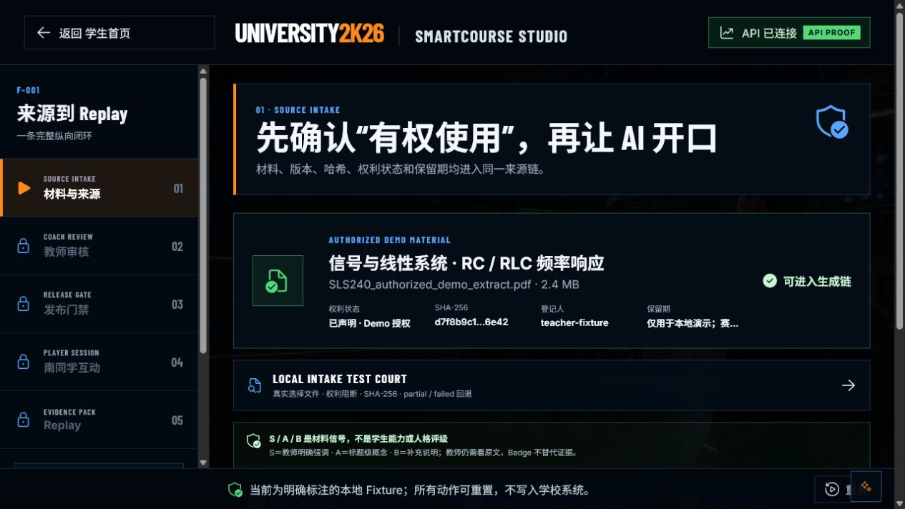
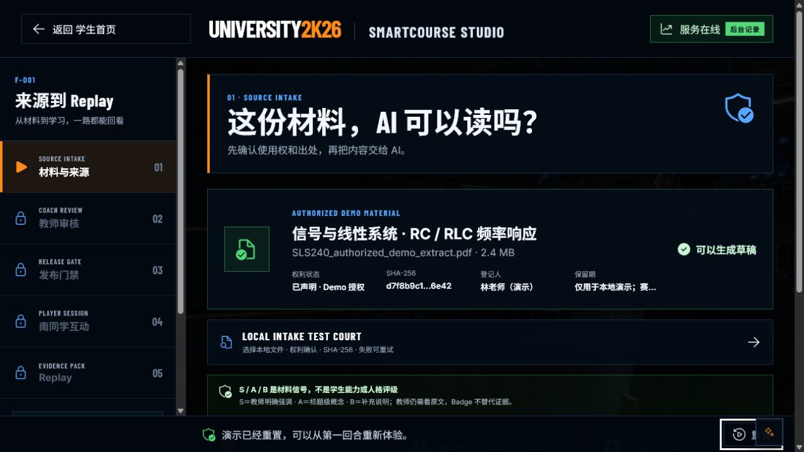
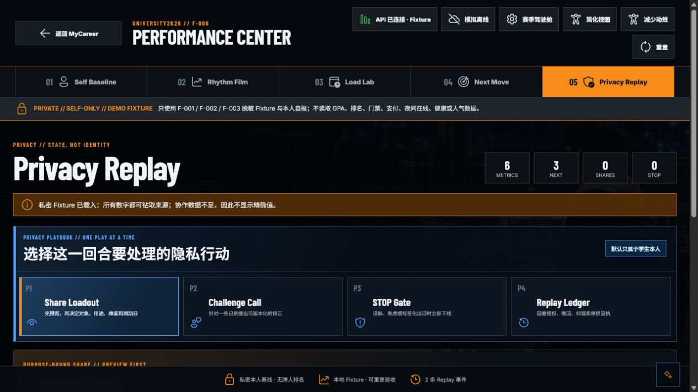
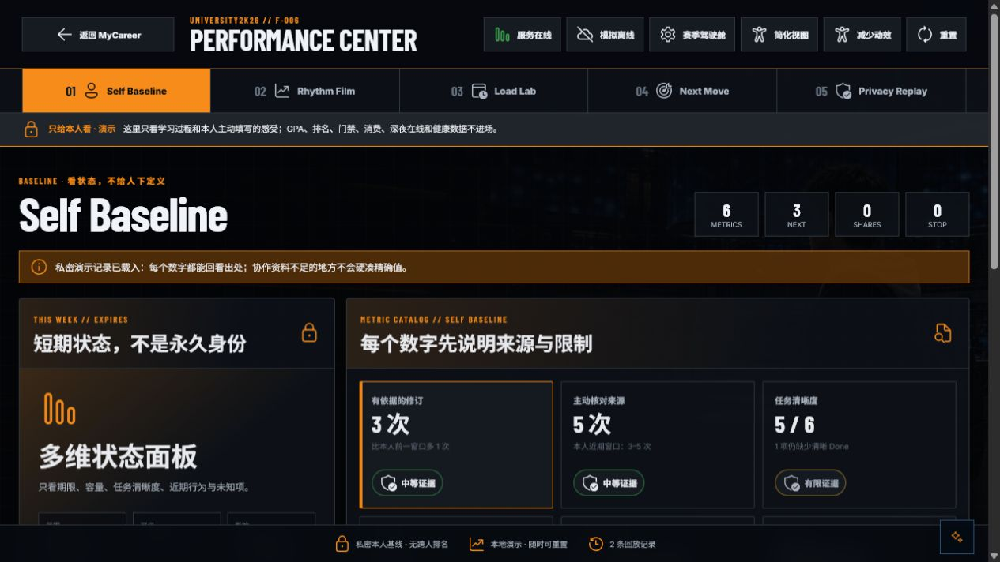
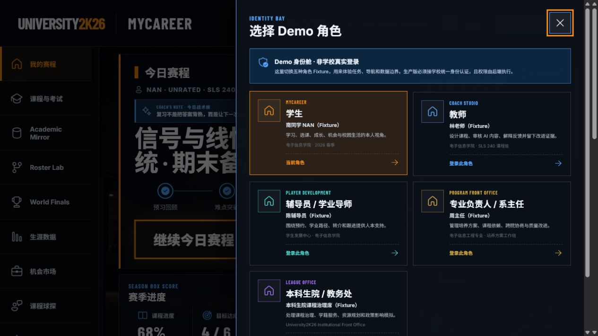
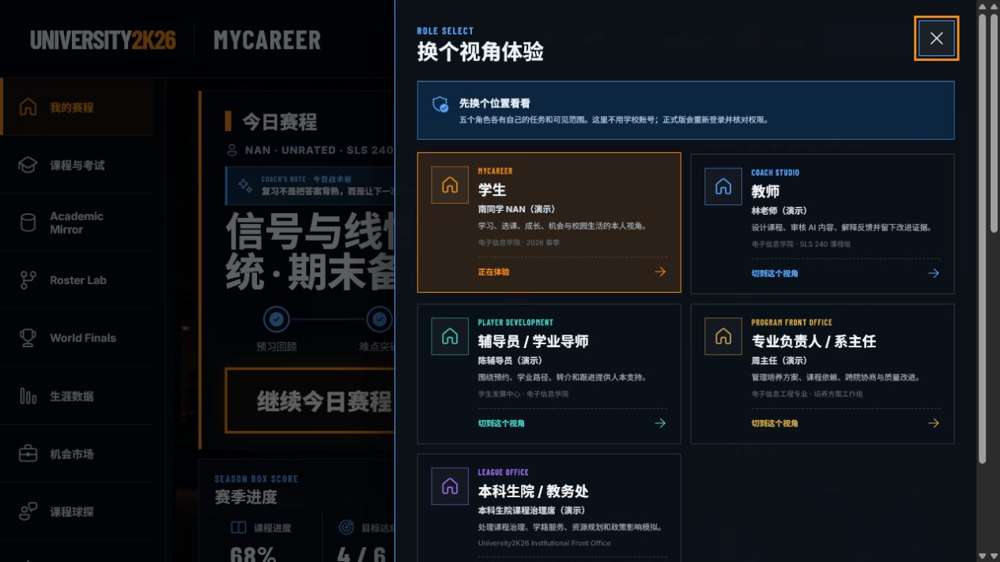

# University2K26 文案与产品声音审计

日期：2026-07-25
范围：学生首页、智课工坊、生涯数据、角色切换、机会市场，以及九个 F 模块的深层可见文案
基线：Qoder `PRODUCT-UX-AUDIT.md`、当前 V0.9 本地实现、同一浏览器会话中的改写前后截图

## 结论

Qoder 的核心判断成立：产品骨架、角色透镜和闭环路径已经成形，最明显的割裂来自“游戏外壳 + 法务/工程控制台文案”。本轮接受并落实了它关于防御性声明下沉、工程术语退出主视野、失败不等于人格标签、下一步必须清楚的建议。

本轮进一步补上了静态审计不容易发现的一层：`Fixture`、`teacher-fixture`、`linked_fixture`、`FALLBACK`、`authoritative=false` 等字段不仅存在于组件，还会从演示数据、缓存状态和深层 Replay 中露出。它们现已在用户界面中改成人能直接理解的说法；内部标识仍保留在数据模型和接口中，没有破坏契约。

## 产品声音

目标不是“甜”，而是：

> 会接梗的同桌，关键时刻很稳的队友。

从用户提供的壁纸总结里，只采纳可观察的审美与沟通偏好，不把它当作性格诊断：

- 温暖、治愈、带一点浪漫和仪式感；
- 熟悉 ACG / B 站梗，愿意互动，也会用轻微自嘲化解压力；
- 清爽、低冲突、重视陪伴，但做决定时不含糊；
- 喜欢故事感和季节感，同时在意秩序与细节。

落地约束：

- 鼓励不许变成空泛夸奖；
- 梗只放在安全、低风险、可撤回的场景；
- 成绩、隐私、申诉、门禁、支付和学校决定保持中性、精确；
- 不用“我们一起赋能”“全方位提升”“智能化闭环”等生成式套话；
- 不把同一句免责声明贴满每个页面；
- 不把内部枚举、版本号、哈希和状态机名字当作产品文案。

详细规则见 `engineering/LOCALIZATION-AND-TONE.md`。

## 审计步骤与健康度

1. **Qoder 审计复核 — 健康**
   - 接受“文案语气 5.5/10 是当前最弱项”的判断。
   - 否决任何把演示数据改写成“100% 真实”的做法；诚实边界保留。

2. **核心界面前后对照 — 已修复**
   - 首页把 `API 已连接 · Fixture` 改为“服务在线”，把演示状态压缩成短标签。
   - 智课工坊把“授权合同/模型门禁”改成“这份材料，AI 可以读吗？”。
   - 生涯数据把“PRIVATE / DEMO FIXTURE”改成“只给本人看 · 演示”和“看状态，不给人下定义”。
   - 角色舱把权限说明改成“先换个位置看看”，同时保留正式版需重新登录核权的事实。
   - 机会市场把长免责声明缩成短句，并用“机会包不是抽卡包”承接产品梗。

3. **九模块深层扫描 — 已修复**
   - 逐页重置演示存档后扫描 Academic Mirror、Roster Lab、World Exam、Coach Scouting、Campus Life、Campus Pass、SmartCourse、Performance Center、Opportunity Market。
   - 可见文本中不再出现 `Fixture`、`fallback`、`sanitized`、`authoritative=false`、`execute=false`、`official_access`。

4. **关键交互试玩 — 已通过**
   - 角色舱可从学生切换到教师，任务、可见范围与首页内容同步变化。
   - 智课工坊可完成“载入材料 → 教师通过 → 发布 → 学生作答 → Replay”。
   - 未选答案时会提示；选择答案后提示立即解除，提交状态同步。
   - 机会市场搜索 `AdventureX` 后只显示一个匹配结果，校内/校外分区保持不混排。
   - 生涯数据重置后旧缓存文案不会继续冒出。

5. **自动化验证 — 健康**
   - 新增文案守门测试，覆盖 16 个主要界面文件和 10 个演示数据文件。
   - 禁止主界面重新出现 `DEMO FIXTURE`、`SANITIZED FIXTURE`、`RULES FALLBACK`、`DETERMINISTIC FALLBACK` 等字样。

6. **工程契约 — 健康**
   - 仅改用户文案和演示内容；内部类型、枚举、数据来源 ID 与安全边界继续保留。
   - AI 不可用时明确说明“AI 这次没上场”，本地规则不会伪装成模型回答。

## 截图对照

### 1. 学生首页

改写前：

改写后：

### 2. 智课工坊

改写前：

改写后：

### 3. 生涯数据

改写前：

改写后：

### 4. 角色切换

改写前：

改写后：

### 5. 机会市场

改写前：

改写后：

## 当前优势

- 游戏化不再只靠全大写标题，而是进入了反馈、失败语义、下一步和角色语言。
- “诚实边界”还在，但不再像免责弹幕一样打断每个回合。
- 学生端的语气更像队友；教师、辅导员和学校端仍保持专业克制。
- AI、规则引擎和演示数据的身份分得更清楚，不会拿模板冒充模型。
- 文案守门测试会阻止常见工程术语重新漏回主界面。

## 剩余风险与限制

- 英文 HUD 标签目前是视觉语言，不等于完整英文产品；全站中英双语仍需单独做信息等价和长度压力测试。
- 本轮没有完成正式屏幕阅读器矩阵、色彩对比度测量和 390px 全流程复测。
- 若后端未来新增字段，仍要经过同一套“内部字段 → 人类文案”的映射层，不能直接插入 JSX。
- 教师审核仍有三个并列操作；本轮保留现有功能，没有把它重构成真正的一回合一主行动。
- World Exam 已有即时加载提示，但还可以继续升级为题卡形状的专属骨架屏。
- 当前语气来自审美线索、现有对话和实机走查，不是正式用户研究结论；赛场前仍建议找一名不熟悉项目的人做 10 分钟首次使用测试。
