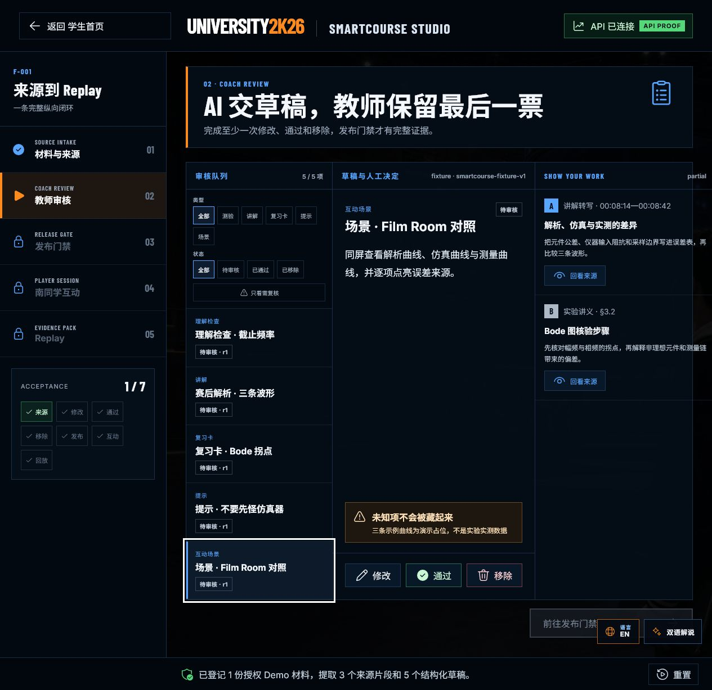
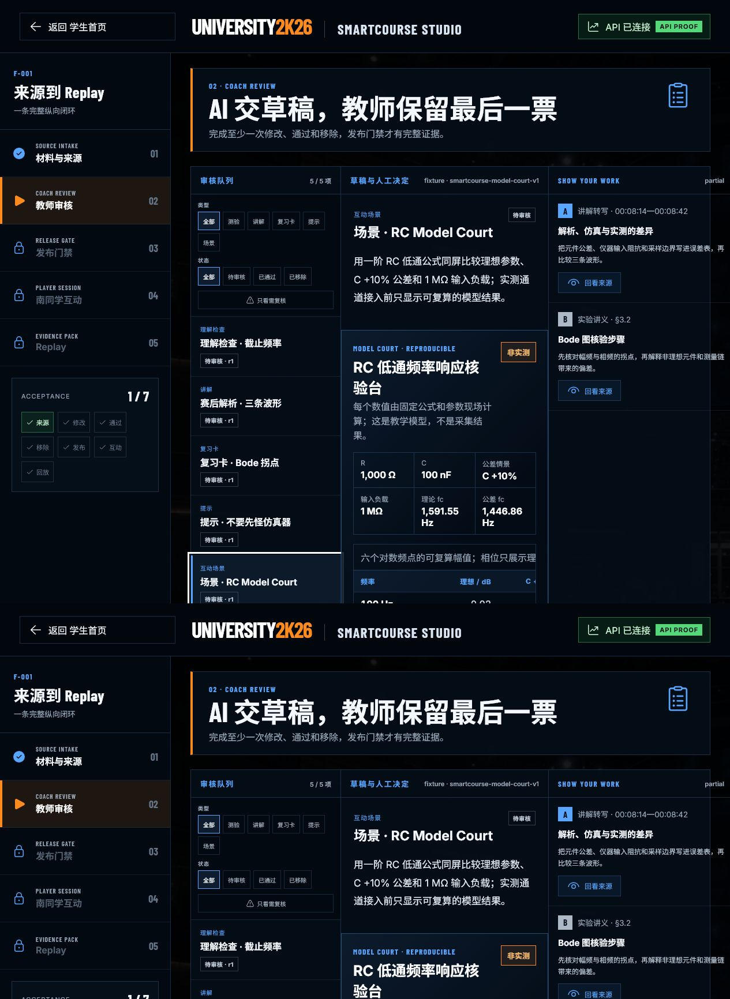
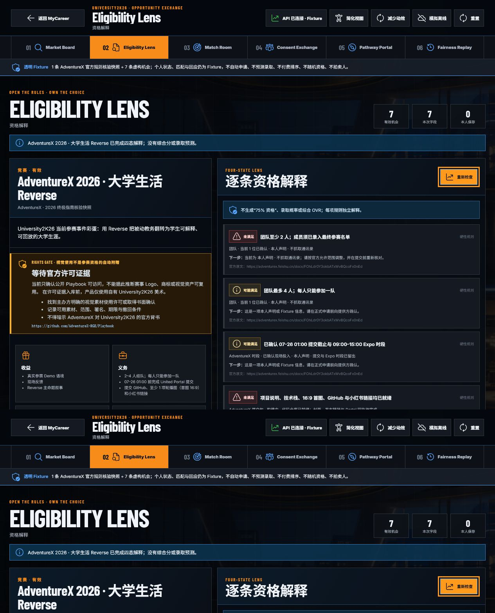
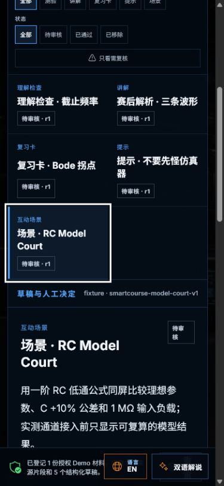

# University2K26 占位清理与可运行能力验收

- 日期：2026-07-25
- 分支：`agent/phase0-foundation`
- 状态：`technical_review`
- 范围：F-001 智课工坊、F-009 机会市场，以及本轮关联的个人学术 Demo 数据

## 结论

本轮清理了两处会让评审误以为“只有壳”的实现占位：

1. F-001 原先只声明“三条示例曲线为演示占位”，现在改为固定参数、固定公式、六个频点可复算的 RC 低通 Model Court；同时明确标注“非实测”。
2. F-009 原先把 AdventureX 条目标为“尚未核验”，现在接入 2026-07-23 官方指南核验快照，并把队伍人数、现场时段和提交包拆成四态资格解释。

没有删除真实外部依赖边界。SIS、支付、门禁、真实仪器、官方视觉许可和正式申请回执仍会诚实显示为未接入或待核验。

## 验收步骤

### 1. F-001 原占位定位

**健康度：需要修复 → 已完成**

原场景有来源与审核流，但“三条曲线”没有可复算数据。



### 2. F-001 RC Model Court

**健康度：通过**

- 1 kΩ、100 nF、C +10% 和 1 MΩ 输入负载均为显式参数。
- 理论截止频率、公差截止频率和六个对数频点由公式计算。
- 表格提供理想、公差、输入负载和相位对照。
- 真实仪器、采样率和校准回执未接入时，界面明确显示“非实测”。
- 来源版本为 `smartcourse-model-court-v1`，没有把公式结果冒充 AI 或实测输出。



### 3. F-009 AdventureX 资格流

**健康度：通过（官方视觉许可仍是安全边界）**

- 机会卡展示提交窗口、队伍范围、交付物、成本和风险。
- `gte` 与 `lte` 同时约束 2–4 人队伍。
- Demo 当前得到 `可能满足 2 / 未满足 2 / 未知 0`，没有生成录取概率或综合 OVR。
- “官方 Playbook 可访问”没有被误推为 Logo、商标或视觉资产许可。



### 4. 390 × 844 窄屏

**健康度：通过**

模型场可由窄屏导航进入；筛选、草稿列表、选中态、正文和底部导览保持可读，没有浏览器错误或警告。



### 5. 自动化与构建

**健康度：通过**

执行：

```powershell
pwsh -NoProfile -ExecutionPolicy Bypass -File .\scripts\verify.ps1
```

结果：

- 35 个 schema、10 个 golden fixture、OpenAPI 与项目 manifest 通过。
- Rust：4 个 AI、1 个 SQLite、28 个 API、3 个 application、40 个 domain 测试通过。
- Web：20 个测试文件、159 个测试通过；TypeScript 类型检查和 Vite 生产构建通过。
- 文档站：184 页构建并完成索引与交接页校验。
- 浏览器桌面与 390 × 844 窄屏控制路径通过，控制台 `error / warn = 0`。

## 仍然保留的诚实边界

以下不是待删的“实现占位”，而是外部授权、真实设备或生产系统依赖：

- 真实 SIS / URP / LMS 写入与学校权威回执；
- 门禁授权、支付清算、签名可信归档；
- 实验仪器采集、采样率、校准和测量不确定度；
- AdventureX 视觉资产使用许可与 United Portal 最终动态字段；
- 正式投递、录取、奖项和外部机构决策。

这些状态必须继续保留来源、权限和人工复核提示，不能为了演示完整度伪造“已完成”。
